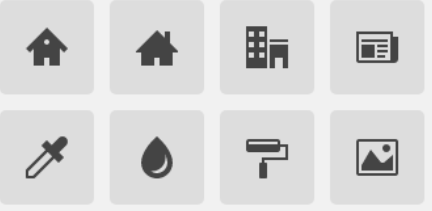
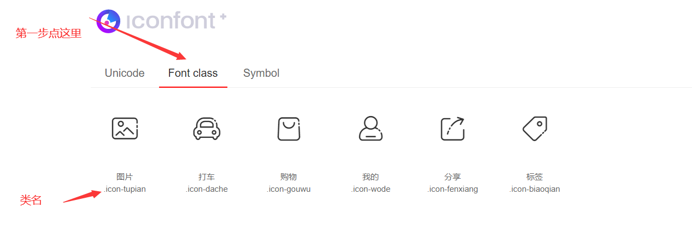
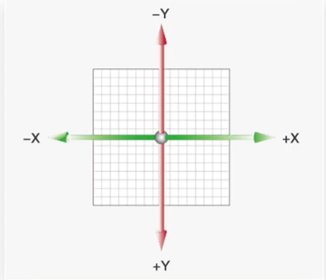
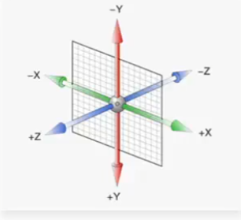
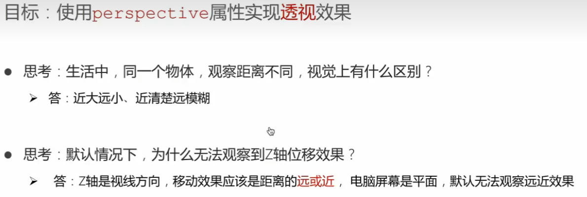

# css进阶

## 字体图标

### 什么是字体图标？

> 字体图标（iconfont)：字体图标就是字体，其实字体是画出来的，以画字体的方式画图标，就是字体图标。
>
> 在网页中我们常会看到一些，箭头，云朵等形状的小图，比如下边这些

### 为什么使用字体图标？

> 我们首先会想到这应当是图片，但是现在它却不是使用图片，图片是有诸多优点的，但是缺点很明显，比如图片不但增加了总文件的大小，还增加了很多额外的"http请求"，这都会大大降低网页的性能的。而且图片不能很好的进行“缩放”，因为图片放大和缩小会失真。 我们后面会学习移动端响应式，很多情况下希望我们的图标是可以缩放的。此时，一个非常重要的技术出现了，额不是出现了，是以前就有，是被重新被"宠幸"了。这就是字体图标（iconfont)。

### 字体图标优点

> - 可以做出跟图片一样可以做的事情,改变透明度、旋转度，等..
> - 但是本质其实是文字，可以很随意的改变颜色、产生阴影、透明效果等等...
> - 本身体积更小，但携带的信息并没有削减。
> - 几乎支持所有的浏览器
> - 移动端设备必备良药...

### 如何去使用字体图标？

> 1. 要想使用它，我们首先需要去下载它，最推荐的是[iconfont-阿里巴巴矢量图标库](http://www.iconfont.cn/)
>
>    这个是阿里妈妈M2UX的一个icon font字体图标字库，包含了淘宝图标库和阿里妈妈图标库。可以使用AI制作图标上传生成。 一个字，免费，免费！！
>
> 1. 下载成功后将文件直接放在项目中
>
> 1. 引入字体图标的css样式表
>
> 1. 在下载的文件中的html文件查看下载的图标的类名信息
>
> 1. 调用图标对应的类名，必须调用两个类名（记住不要带“.”）
>
>    iconfont类：基本样式，包含字体的使用等
>
>    icon-xxx：图标对应的类名
>
> 1. 一般我们将字体图标引入span这种行内标签
>
> 1. 字体图标可以直接视为文字，因此文字的样式如何更改，字体图标就如何更改
>
> 1. 当我们所需要的图标在阿里巴巴图标是矢量库中没有时，我们可以通过先在其上传矢量图（svg格式）再下载。
>
> 1. 字体图标更深的内容不在此探讨

> ```html
> <!DOCTYPE html>
> <html lang="en">
> <head>
>     <meta charset="UTF-8">
>     <meta http-equiv="X-UA-Compatible" content="IE=edge">
>     <meta name="viewport" content="width=device-width, initial-scale=1.0">
>     <link rel="stylesheet" href="./iconfond/iconfont.css">
>     <title>Document</title>
>     <style>
>         /* 用于实现简单的图标 
>             灵活性高，轻量级，兼容性，使用方便
>             字体图标其实就是字，下载相应的字体图标包
>         */
>         .iconfont{
>             font-size: 100px;
>             color: pink;
>         }
>     </style>
> </head>
> <body>
>     <span class="iconfont icon-tupian"></span>
>     <span class="iconfont icon-dache"></span>
>     <span class="iconfont icon-gouwu"></span>
>     <span class="iconfont icon-wode"></span>
>     <span class="iconfont icon-fenxiang"></span>
>     <span class="iconfont icon-biaoqian"></span>
> 
> </body>
> </html>
> ```

## 平面转换

### 什么是平面转换？

> 用于改变盒子在平面内的形态。一般包含（位移、旋转、缩放）
>
> 在实际开发中**位移、缩放** 常用**旋转**不常用
>
> 2D转换

### 如何去平面转换？

> 
>
> **属性：** transform

### 代码实现

#### 1.位移-基本使用

> **语法：** tranform:translate(Xpx,Ypx);
>
> **取值：**
>
> - 正负都可以
> - 单位是像素单位
> - 百分比（参考盒子自身的尺寸）
> - X轴正值为右，Y轴正值为左

> ```html
> <!DOCTYPE html>
> <html lang="en">
> 
> <head>
>     <meta charset="UTF-8">
>     <meta http-equiv="X-UA-Compatible" content="IE=edge">
>     <meta name="viewport" content="width=device-width, initial-scale=1.0">
>     <title>位移-基本使用</title>
>     <style>
>         .father {
>             width: 500px;
>             height: 300px;
>             margin: 100px auto;
>             border: 1px solid #000;
>         }
>         
>         .son {
>             width: 200px;
>             height: 100px;
>             background-color: pink;
>             transition: all 0.5s;
>         }
>     
>         /* 鼠标移入到父盒子，son改变位置 */
>         .father:hover .son {
>             /* transform: translate(100px, 50px); */
> 
>             /* 百分比: 参考盒子自身尺寸的百分比 */
>             transform: translate(100%, 50%);
> 
>             /* transform: translate(-100%, 50%); */
> 
>             /* 只给出一个值表示x轴移动距离 */
>             /* transform: translate(100px); */
> 
>             /* transform: translateY(100px); */
>         }
>     </style>
> </head>
> 
> <body>
>     <div class="father">
>         <div class="son"></div>
>     </div>
> </body>
> 
> </html>
> ```

#### 2.绝对定位元素居中效果

> ```html
> <!DOCTYPE html>
> <html lang="en">
> <head>
>     <meta charset="UTF-8">
>     <meta http-equiv="X-UA-Compatible" content="IE=edge">
>     <meta name="viewport" content="width=device-width, initial-scale=1.0">
>     <title>绝对定位元素居中效果</title>
>     <style>
>         .father {
>             position: relative;
>             width: 500px;
>             height: 300px;
>             margin: 100px auto;
>             border: 1px solid #000;
>         }   
>         .son {
>             position: absolute;
>             left: 50%;
>             top: 50%;
>             /* margin-left: -100px;
>             margin-top: -50px; */
>             /* 在实际开发不再使用初级课程中的上述方法，因为这个新方法能够根据盒子自身大小改变位置 */  	  
>             transform: translate(-50%, -50%);
>             width: 203px;
>             height: 100px;
>             background-color: pink;          
>         }
>     </style>
> </head>
> <body>
>     <div class="father">
>         <div class="son"></div>
>     </div>
> </body>
> </html>
> ```

#### 3.旋转效果

> **语法：** transform: rotate(Xdeg);
>
> **取值：**
>
> - 正负都可以
> - 单位是角度edg
> - 正值为顺时针，负值为逆时针

> ```html
> <!DOCTYPE html>
> <html lang="en">
> <head>
>     <meta charset="UTF-8">
>     <meta http-equiv="X-UA-Compatible" content="IE=edge">
>     <meta name="viewport" content="width=device-width, initial-scale=1.0">
>     <title>旋转效果</title>
>     <style>
>         img {
>             width: 250px;
>             transition: all 2s;
>         }
>         
>         img:hover {
>             /* 顺 */
>             transform: rotate(360deg);
> 
>             /* 逆 */
>             /* transform: rotate(-360deg); */
>         }
> 
>         
>     </style>
> </head>
> <body>
>     
> </body>
> </html>
> ```

#### 4.转换原点

> **语法：**  transform-origin: X Y;
>
> **取值：**
>
> - 百分比
> - 单位是角度edg
> - top、right、bottom、left和center这样的关键词。

> ```html
> <!DOCTYPE html>
> <html lang="en">
> <head>
>     <meta charset="UTF-8">
>     <meta http-equiv="X-UA-Compatible" content="IE=edge">
>     <meta name="viewport" content="width=device-width, initial-scale=1.0">
>     <title>转换原点</title>
>     <style>
>         img {
>             width: 250px;
>             border: 1px solid #000;
>             transition: all 2s;
>             transform-origin: right bottom;
>             /* transform-origin: left bottom; */
>         }
>         
>         img:hover {
>             transform: rotate(360deg);
>         }
>     </style>
> </head>
> <body>
>     
> </body>
> </html>
> ```
>
> 

#### 5.多重转换

> **语法：**  transform: translate(Xpx Ypx) rotate(Ndeg);
>
> **取值：**
>
> - 参考上边。

> ```html
> <!DOCTYPE html>
> <html lang="en">
> 
> <head>
>     <meta charset="UTF-8">
>     <meta http-equiv="X-UA-Compatible" content="IE=edge">
>     <meta name="viewport" content="width=device-width, initial-scale=1.0">
>     <title>多重转换</title>
>     <style>
>         .box {
>             width: 800px;
>             height: 200px;
>             border: 1px solid #000;
>         }
>         
>         img {
>             width: 200px;
>             transition: all 8s;
>         }
>         
>         .box:hover img {
>             /* 边走边转 ,注意必须按照这个顺序*/
>             transform: translate(600px) rotate(360deg);
> 
>             /* 旋转可以改变坐标轴向 */
>             /* transform: rotate(360deg) translate(600px); */
>             
>             /* 层叠性 */
>             /* transform: translate(600px);
>             transform: rotate(360deg); */
>         }
>     </style>
> </head>
> 
> <body>
>     <div class="box">
>         
>     </div>
> </body>
> 
> </html>
> ```

#### 6.缩放

> **语法：** transform: scale(X);
>
> **取值：**
>
> - 数字，大于1放大，小于1缩小

> ```html
> <!DOCTYPE html>
> <html lang="en">
> 
> <head>
>     <meta charset="UTF-8">
>     <meta http-equiv="X-UA-Compatible" content="IE=edge">
>     <meta name="viewport" content="width=device-width, initial-scale=1.0">
>     <title>缩放效果</title>
>     <style>
>         .box {
>             width: 300px;
>             height: 210px;
>             margin: 100px auto;
>             background-color: pink;
>             
>         }
> 
>         .box img {
>             width: 100%;
>             transition: all 0.5s;
>         }
>         
>         .box:hover img {
>             /* width: 150%; */
>  
>             transform: scale(1.2);
>             transform: scale(0.8);
>         }
>     </style>
> </head>
> 
> <body>
>     <div class="box">
>         
>     </div>
> </body>
> 
> </html>
> ```

## 渐变

> **语法：**background-image: linear-gradient(direction, color-stop1, color-stop2, ...);
>
> **取值：**
>
> - 渐变的取值形式较多，可在网上查阅

> ```html
> <!DOCTYPE html>
> <html lang="en">
> 
> <head>
>     <meta charset="UTF-8">
>     <meta http-equiv="X-UA-Compatible" content="IE=edge">
>     <meta name="viewport" content="width=device-width, initial-scale=1.0">
>     <title>渐变背景</title>
>     <style>
>         .box {
>             width: 300px;
>             height: 200px;
>             /* background-image: linear-gradient(
>                 pink,
>                 green,
>                 hotpink
>             ); */
>             background-image: linear-gradient(
>                 transparent,
>                 rgba(0,0,0, .6)
>             );
>         }
>     </style>
> </head>
> <body>
>     <div class="box"></div>
> </body>
> </html>
> ```

## 空间转换

### 什么是空间转换？

> 用于改变盒子在平面内的形态。一般包含（位移、旋转、缩放）
>
> 在实际开发中**位移、缩放** 常用，**旋转**不常用
>
> 3D转换

### 如何去空间转换？

> 
>
> **属性：** transform

### 代码实现

#### 1.位移

> **语法：** tranform:translate3d(Xpx,Ypx,Zpx);
>
> **取值：**
>
> - 正负都可以
> - 单位是像素单位
> - X轴正值为右，Y轴正值为左，Z的正值为屏幕外

> ```html
> <!DOCTYPE html>
> <html lang="en">
> 
> <head>
>   <meta charset="UTF-8">
>   <title>空间位移</title>
>   <style>
>     .box {
>       width: 200px;
>       height: 200px;
>       margin: 100px auto;
>       background-color: pink;
>       transition: all 0.5s;
>     }
> 
>     .box:hover {
>       transform: translate3d(50px,100px,200px);
>       /* transform: translateX(50px);
>       transform: translateY(100px);
>       transform: translateZ(200px); */
> 
>     }
>   </style>
> </head>
> 
> <body>
>   <div class="box"></div>
> </body>
> 
> </html>
> ```
>
> 

#### 2.透视

> 

> **语法：** perspective: Xpx;
>
> **取值：**
>
> - 单位是像素单位
> - 建议数值800-1200

> ```html
> <!DOCTYPE html>
> <html lang="en">
> 
> <head>
>   <meta charset="UTF-8">
>   <title>透视效果</title>
>   <style>
>     body {
>       /* 加在父级上 */
>       perspective: 1000px;
>     }
> 
>     .box {
>       width: 200px;
>       height: 200px;
>       margin: 100px auto;
>       background-color: pink;
>       transition: all 0.5s;
>     }
> 
>     .box:hover{
>       transform: translateZ(200px);
>     }
>   </style>
> </head>
> 
> <body>
>   <div class="box">1111111111</div>
> </body>
> 
> </html>
> ```
>
> 

#### 3.旋转

> **z轴语法：**transform: rotateZ(Zdeg);
>
> **取值：**
>
> - 正负都可以
> - 单位是角度edg
> - 正值为顺时针，负值为逆时针

> ```html
> <!DOCTYPE html>
> <html lang="en">
> <head>
>     <meta charset="UTF-8">
>     <meta http-equiv="X-UA-Compatible" content="IE=edge">
>     <meta name="viewport" content="width=device-width, initial-scale=1.0">
>     <title>空间旋转-Z轴</title>
>     <style>
>         .box {
>             width: 300px;
>             margin: 100px auto;
>         }
> 
>         img {
>             width: 300px;
>             transition: all 2s;
>         }
> 
>         .box img:hover {
>             transform: rotateZ(360deg);
>         }
>     </style>
> </head>
> <body>
>     <div class="box">
>         
>     </div>
> </body>
> </html>
> ```

> **z轴语法：**transform: rotateZ(Zdeg);
>
> **取值：**
>
> - 正负都可以
> - 单位是角度edg
> - 正值为顺时针，负值为逆时针

> ```html
> <!DOCTYPE html>
> <html lang="en">
> <head>
>     <meta charset="UTF-8">
>     <meta http-equiv="X-UA-Compatible" content="IE=edge">
>     <meta name="viewport" content="width=device-width, initial-scale=1.0">
>     <title>空间旋转-Z轴</title>
>     <style>
>         .box {
>             width: 300px;
>             margin: 100px auto;
>         }
> 
>         img {
>             width: 300px;
>             transition: all 2s;
>         }
> 
>         .box img:hover {
>             transform: rotateZ(360deg);
>         }
>     </style>
> </head>
> <body>
>     <div class="box">
>         
>     </div>
> </body>
> </html>
> ```

> **x轴语法：**transform: rotateX(Xdeg);
>
> **取值：**
>
> - 正负都可以
> - 单位是角度edg
> - 正值为顺时针，负值为逆时针

> ```html
> <!DOCTYPE html>
> <html lang="en">
> <head>
>     <meta charset="UTF-8">
>     <meta http-equiv="X-UA-Compatible" content="IE=edge">
>     <meta name="viewport" content="width=device-width, initial-scale=1.0">
>     <title>空间旋转-X轴</title>
>     <style>
>         .box {
>             width: 300px;
>             margin: 100px auto;
>         }
> 
>         img {
>             width: 300px;
>             transition: all 2s;
>         }
> 
>         .box {
>             /* 透视效果：近大远小，近实远虚 */
>             perspective: 1000px;
>         }
> 
>         .box img:hover {
>             transform: rotateX(360deg);
>             
>         }
>     </style>
> </head>
> <body>
>     <div class="box">
>         
>     </div>
> </body>
> </html>
> ```

> **y轴语法：**transform: rotateY(Ydeg);
>
> **取值：**
>
> - 正负都可以
> - 单位是角度edg
> - 正值为顺时针，负值为逆时针

> ```html
> <!DOCTYPE html>
> <html lang="en">
> <head>
>     <meta charset="UTF-8">
>     <meta http-equiv="X-UA-Compatible" content="IE=edge">
>     <meta name="viewport" content="width=device-width, initial-scale=1.0">
>     <title>空间旋转-Y轴</title>
>     <style>
>         .box {
>             width: 300px;
>             margin: 100px auto;
>         }
> 
>         img {
>             width: 300px;
>             transition: all 2s;
>         }
> 
>         .box {
>             /* 透视效果：近大远小，近实远虚 */
>             perspective: 1000px;
>         }
> 
>         .box img:hover {
>             transform: rotateY(360deg);
>             
>         }
>     </style>
> </head>
> <body>
>     <div class="box">
>         
>     </div>
> </body>
> </html>
> ```

> **自定义轴语法：**transform: rotate3d(x,y,z,Ndeg);
>
> **取值：**
>
> - xyz取值为0-1的数字

#### 4.立体呈现

> 

> **语法：** tranform:translate3d(Xpx,Ypx,Zpx);
>
> **取值：**
>
> - 正负都可以

> ```html
> 
> ```
>
> 

#### 

> **语法：** tranform:translate3d(Xpx,Ypx,Zpx);
>
> **取值：**
>
> - 正负都可以

> ```html
> 
> ```
>
> 

#### 

> **语法：** tranform:translate3d(Xpx,Ypx,Zpx);
>
> **取值：**
>
> - 正负都可以

> ```html
> 
> ```
>
> 

#### 

> **语法：** tranform:translate3d(Xpx,Ypx,Zpx);
>
> **取值：**
>
> - 正负都可以

> ```html
> 
> ```
>
> 

