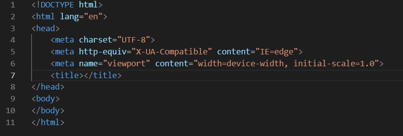
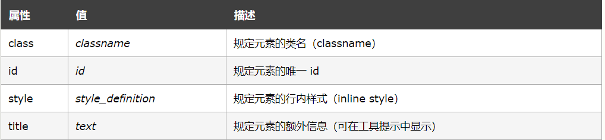
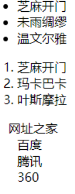
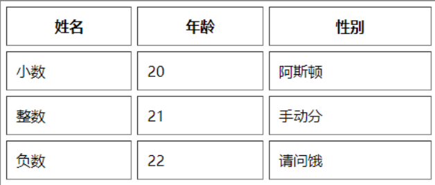
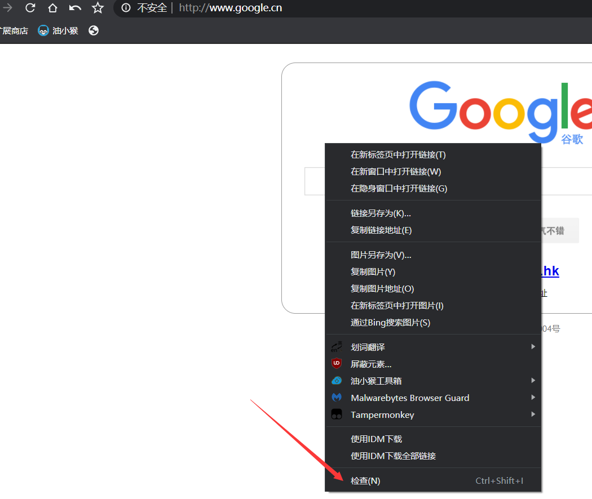
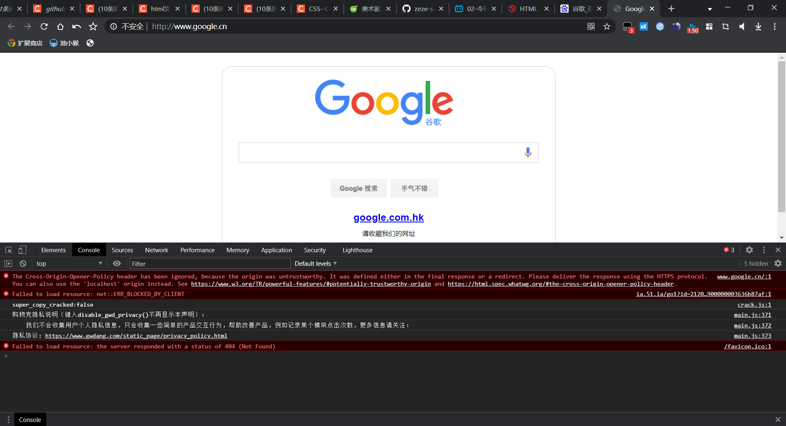
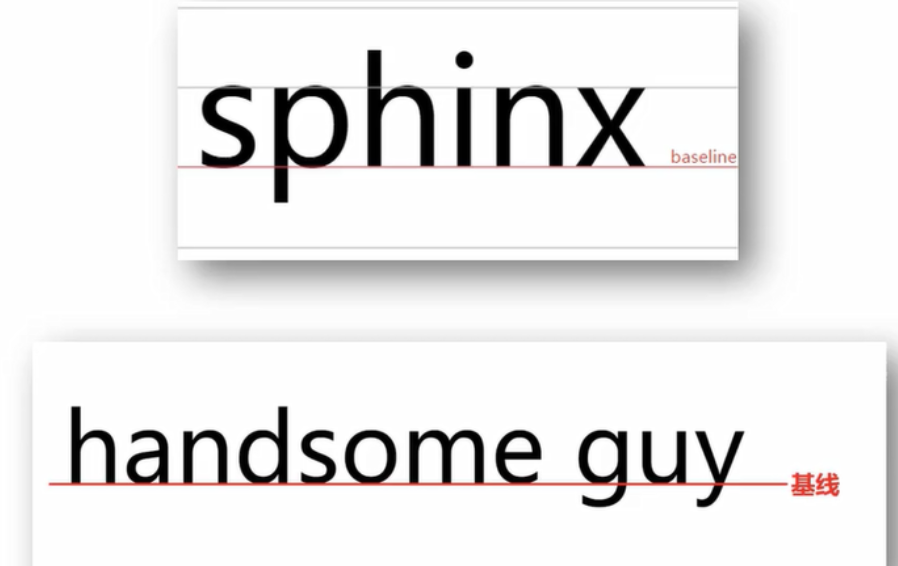
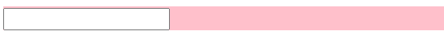
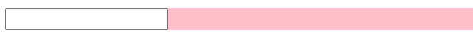

# html概述

### 什么是html？

> HTML 是用来描述网页的一种语言。
>
> - HTML 指的是超文本标记语言 (**H**yper **T**ext **M**arkup **L**anguage)
> - HTML 不是一种编程语言，而是一种*标记语言* (markup language)
> - 标记语言是一套*标记标签* (markup tag)
> - HTML 使用*标记标签*来描述网页
> - 【超文本】：网页本身是一个文本文件，而超文本指的是这种文件中既可以包含文本信息，又可以包含图片，音频，视频和链接等非文字的信息。
> - 【标记语言】：标记，也叫做标签。也就是说HTML这门语言是由标签组成的。
> - HTML通过提前约定好的标签来构建我们的网页内容，通过浏览器来进行解释执行，浏览器是一个HTML的解释器，在浏览器中内置了一个解释器，该解释器中包含了所有HTML标签的展示风格

### html由什么组成？

> **html文档==网页**

> - HTML 文档*描述网页*
> - HTML 文档 包含 HTML **标签**和**纯文本**
> - HTML 文档也被称为***网页***
>
> Web 浏览器的作用是读取 HTML 文档，并以网页的形式显示出它们。浏览器不会显示 HTML 标签，而是使用标签来解释页面的内容

### 什么是html标签？

> HTML 标记标签通常被称为 HTML 标签 (HTML tag)。
>
> - HTML 标签是由*尖括号*包围的关键词，比如 `<html>`
> - HTML 标签通常是*成对出现*的，比如 `<b> 和 </b>`
> - 标签对中的第一个标签是***开始标签***，第二个标签是***结束标签***
> - 开始和结束标签也被称为***开放标签*和*闭合标签***

### 用什么来编写html？

> html只是一种标记语言，它的运行依靠浏览器对其的解释，因此编写html只需要像写文档那样即可，并不需要特殊的编译环境
>
> 常用的编写html的免费工具有：VScode等
>
> [VScode下载]( https://code.visualstudio.com/)
>
> 需要中文版可以下载中文插件，具体参考网络教程

### 第一次编写html

> 1. 打开VScode
> 1. 新建一个文件，将文件命名为 文件名.html
> 1. 在文件中输入  ！（英文状态下）+ Enter此时VScode会自动生成html的必要骨架，如图
> 1. 在<body></body>间输入任意文字
> 1. 先Ctrl+S保存  再Alt+B快捷默认浏览器打开，就制作出你的第一个网页了

## html骨架

以下就是html5骨架的大致描述

```html
<!DOCTYPE html><!-- 这是网所使用的html语言类型，这是html5的表示 -->
<html lang="en"><!-- 这是网站所使用的语言，这是英语的表示，zh-CN（中文） -->
<head>
     <!-- 这里是网页的头部，用来定义或引用一些东西 -->
    <meta charset="UTF-8"><!-- 这是使用的文字编码 -->
    <meta http-equiv="X-UA-Compatible" content="IE=edge"><!-- 用于解决ie浏览器的兼容性 -->
    <meta name="viewport" content="width=device-width, initial-scale=1.0"><!-- 为了和移动端兼容 -->
    <title>这里是网页的标题</title>
</head>
<body>
    这里是网页的主体
</body>
</html>
```

## html注释

> 在学习一门新的编程语言的时候我们应该先学会的是这个语言的注释格式
>
> 从而使我们在学习代码的途中更好的去注释
>
> - 在html里<!-- -->就是注释的格式

```html
<!DOCTYPE html>
<html lang="en">
<head>
    <meta charset="UTF-8">
    <meta http-equiv="X-UA-Compatible" content="IE=edge">
    <meta name="viewport" content="width=device-width, initial-scale=1.0">
    <title>html注释</title>
</head>
<body>
    
    <!-- 这是html语言的注释格式 -->
    <!-- 注释一行的快捷键 ctrl+/ -->
    <!-- 注意！！！不能使用数字键盘上的斜杠 -->
</body>
</html>
```

> ```html
> <html> </html> ：页面中最大的标签，也称根标签
> <head> </head> ：文档的头部，在 head 标签中必须设置 title (标题)
> <title> </title> ：文档的标题，让网页拥有一个标题
> <body> </body> ：文档的主体，所有内容基本都放在 body 里
> ```
>
> 

## html标签

### 标签是干什么的？

> 在前边我们就说过html语言是有各种标签和纯文本组成的，其中纯文本就是网页中显示的内容，而标签则是浏览器需要识别并作出相应布局的东西

### 都有什么标签？

> HTML的标签包含以下两种:
>
> (1) 带有标签体的标签< a>标签体< /a >（有些标签的标签体可以为空）
>
> (2) 不带标签体的标签(自结束标签)< br/>,< hr/>（在html中自结束标签中的/可以不写也能够被识别成功，但是为了标签能够形成都需要结束标签表示结束的规范，建议都带上/）

### 常用的html标签有哪些？

> - **标题：h1 ~ h6 标签**
>
> 1. `<h1> </h1>` ：一级标题
> 1. `<h2> </h2>` ：二级标题
> 1. `<h3> </h3>` ：三级标题
> 1. `<h4> </h4>` ：四级标题
> 1. `<h5> </h5>` ：五级标题
> 1. `<h6> </h6>` ：六级标题
>
> - **段落：p 标签**
>
>   `<p> </p>` ：生成一个段落
>
> - **换行：br 标签**
>
>   `<br/>` ：break 的缩写，强制换行
>
> - **水平线：hr标签**
>
>   `<hr/>`：做一条水平线
>
> - **文本格式化**
>
> 1. `<strong> </strong>` 或 `<b> </b>` ：加粗
> 1. `<em> </em>` 或 `<i> </i>` ：倾斜
> 1. `<del> </del>` 或 `<s> </s>` ：删除线
> 1. `<ins> </ins>` 或 `<u></u>` ：下划线
>
> - **盒子标签**
>
> 1. `<div> </div>` 标签用来布局，但是一行只能放**一个** div 标签
>
> 2. `<span> </span>` 标签用来布局，但是一行可以放**多个** span 标签
>
> - **图像：img 标签**
>   - 标签格式：``
>
> - **超链接：a 标签**
>
>   标签格式：`<a href="跳转目标" target="目标窗口弹出方式">文本或图像</a>`

## html 元素

> html 元素指的是从开始标签（start tag）到结束标签（end tag）的所有代码。
>
> html元素和标签的区别，简单的理解：
>
> ```html
> <p>这就是标签；
> <p>这是内容</p>这是一个元素，也就是说元素由一个开始标签和结束标签组成，用来包含内容
> 有一值得注意的例外，<br />本身就是开始标签也是结束标签，不包含内容，所以这只是一个标签。
> ```

### html元素的语法

> - HTML 元素以*开始标签*起始
> - HTML 元素以*结束标签*终止
> - *元素的内容*是开始标签与结束标签之间的内容
> - 某些 HTML 元素具有*空内容（empty content）*
> - 空元素*在开始标签中进行关闭*（以开始标签的结束而结束）
> - 大多数 HTML 元素可拥有*属性*

### 嵌套的html元素

> 大多数 html 元素可以嵌套（可以包含其他 HTML 元素）。
>
> html 文档由嵌套的 html 元素构成。

### 不要忘记结束标签

> 即使您忘记了使用结束标签，大多数浏览器也会正确地显示 HTML：
>
> ```html
> <p>This is a paragraph
> <p>This is a paragraph
> ```
>
> 上面的例子在大多数浏览器中都没问题，但不要依赖这种做法。忘记使用结束标签会产生不可预料的结果或错误。

## html属性

> HTML 标签可以拥有*属性*。属性提供了有关 HTML 元素的*更多的信息*。
>
> 属性总是（但非一定）以名称/值对的形式出现，比如：*name="value"*。
>
> 属性总是在 HTML 元素的*开始标签*中规定。

### 如何去使用属性？

> ```html
>  链接由 <a> 标签定义。链接的地址在 href 属性中指定：
> <a href="http://www.zeze-sq.github.io">This is a link</a>
> ```

### 大多数标签都可以使用的属性

> 
>
> 至于这些属性的使用我们会在后边涉及

# html基础标签

> html标签众多，但常用的基础标签并不多，很快就能学完

## 标题标签

> 标题标签用来声明标题，利用好标题标签也有利于用在浏览器中更好的发现你的网站

> ```html
> <!DOCTYPE html>
> <html lang="en">
> <head>
>     <meta charset="UTF-8">
>     <meta http-equiv="X-UA-Compatible" content="IE=edge">
>     <meta name="viewport" content="width=device-width, initial-scale=1.0">
>     <title>html标题标签</title>
> </head>
> <body>
>     <h1>1级标题</h1>
>     <h2>2级标题</h2>
>     <h3>3级标题</h3>
>     <h4>4级标题</h4>
>     <h5>5级标题</h5>
>     <h6>6级标题</h6>
>     <!-- 标题特点：1.标题独占一行 2.标题有加粗效果  -->
>     <!-- 注意！！！标题只有一级到六级 -->
> </body>
> </html>
> ```

## 段落标签

> 段落标签常被用来填充文本内容

> ```html
> <!DOCTYPE html>
> <html lang="en">
> <head>
>     <meta charset="UTF-8">
>     <meta http-equiv="X-UA-Compatible" content="IE=edge">
>     <meta name="viewport" content="width=device-width, initial-scale=1.0">
>     <title>html段落标签</title>
> </head>
> <body>
>     <p>This is a paragraph</p>
>     <p>This is another paragraph</p>
>     <!-- 特点：1.独占一行  2.段落之间有间距 -->
> </body>
> </html>
> ```

## 换行，水平线标签

> 换行标签和水平线标签都是比较常用的标签，水平线常用来分割面板

> ```html
> <!DOCTYPE html>
> <html lang="en">
> <head>
>     <meta charset="UTF-8">
>     <meta http-equiv="X-UA-Compatible" content="IE=edge">
>     <meta name="viewport" content="width=device-width, initial-scale=1.0">
>     <title>html换行，水平线标签</title>
> </head>
> <body>
>     <p>这句话后边的话将换行<br/>这行话被换行了</p>
>     <p>
>         春眠不觉晓，
>           处处闻啼鸟。
>             夜来风雨声，
>               花落知多少。
>               <hr/>
>               <!-- <hr/>是一个水平线标签 -->
>     </p>
>     
>     <!-- 注意，浏览器会自动忽略源代码中的排版（省略了多余的空格和换行，它们都将值被识别为一个空格）。 -->
>     <!-- 段落的行数依赖于浏览器窗口的大小。如果调节浏览器窗口的大小，将改变段落中的行数。 -->
> </body>
> </html>
> ```

## 文本格式化标签

> 对于将文本加粗，斜体，删除线等效果统称为文本格式化

> ```html
> <!DOCTYPE html>
> <html lang="en">
> <head>
>     <meta charset="UTF-8">
>     <meta http-equiv="X-UA-Compatible" content="IE=edge">
>     <meta name="viewport" content="width=device-width, initial-scale=1.0">
>     <title>html文本格式化标签</title>
> </head>
> <body>
>     <!-- 让文本出现加粗，下划线，倾斜，删除线效果称为文本格式化 -->
>     <!-- 每种格式化的方式都有两种方法，单词形式的具有强调效果（但是外观一样）比如特价 -->
>     <b>b加粗</b>
>     <strong>strong加粗</strong>
>     <u>u下划线</u>
>     <ins>ins下划线</ins>
>     <i>i倾斜</i>
>     <em>em倾斜</em>
>     <s>s删除线</s>
>     <del>删除线</del>
> </body>
> </html>
> ```

## 媒体标签

> 从这里开始我们将接触链接和文件路径
>
> 因此需要了解文件的先对路径和绝对路径
>
> - 绝对路径：从根目录开始的路径，在win系统下指的是从C盘或D盘等开始的路径，如C:\Program Files\Adobe\Common。在linux系统中指从./开始的文件路径，显然绝对路径很不方便，不仅不同系统下路径的起始不同，并且当挪动文件时就会造成路径失效等问题
> - 相对路径：从当前文件开始的路径，这也是我们最常用的路径，./指当前文件../指返回上一级目录
>
> 媒体标签：图片 音频 视频 超链接等
>
> 下面代码的相关文件统一打包在webcode文件夹

> ```html
> <!DOCTYPE html>
> <html lang="en">
> <head>
>     <meta charset="UTF-8">
>     <meta http-equiv="X-UA-Compatible" content="IE=edge">
>     <meta name="viewport" content="width=device-width, initial-scale=1.0">
>     <title>html媒体标签</title>
> </head>
> <body>
>     <!-- 媒体标签：图片 音频 视频 超链接等 -->
>     <!-- 媒体标签的属性
>         1.src 链接
>         2.alt 替换文本
>         3.title 提示文本
>         4.width和height 宽高 一般只需要使用其中一个，另一个会同图片等比例缩放 -->
> <hr/>
>     <!-- 1.图片标签 img-->
>     
> <hr/>
>     <!-- 2.绝对路径和相对路径 -->
>     <!-- 建议使用相对路径 -->
>     <!-- 绝对路径 自盘符开始的文件路径-->
>     
>     <!-- 相对路径 自当前文件开始的文件路径 -->
>     
>     
> <hr/>
>     <!-- 3.音频标签 audio（建议使用mp3格式）-->
>     <!-- 属性：
>             1.src 文件路径
>             2.controls 播放控件
>             3.autoplay 自动播放（有的浏览器不支持）
>             4.loop 循环播放   -->
>     <audio src="audio/7-html媒体标签-1.mp3" controls autoplay loop></audio>
> <hr/>
>     <!-- 4.视频标签 video（建议使用MP4格式）-->
>     <!-- 属性：
>             1.src 文件路径
>             2.controls 播放控件
>             3.autoplay 自动播放（谷歌浏览器需要配合muted才能实现静音播放）
>             4.loop 循环播放   -->
>     <video src="video/7-html媒体标签-1.mp4" controls autoplay muted loop></video>
> <hr/>
>     <!-- 5.链接标签 a -->
>     <!-- 属性:
>             1.href 跳转地址
>             2.target 新页面打开形式 取值 _self 默认值,在当前页面打开  _blank 在新的页面打开 -->
>     <a href="https://www.w3school.com.cn/index.html">w3school</a>
>     <!-- 注意!!!在网站开发初期不知道跳转地址时写#,#被称为空链接 -->
>     <a href="#">这是一个空链接,点击它会重新跳转至本页面</a>
>     <a href="https://www.w3school.com.cn/index.html" target="_self">w3school这是一个加了_self的链接</a>
>     <a href="https://www.w3school.com.cn/index.html" target="_blank">w3school这是一个加了_blank的链接</a>
> 
> </body>
> </html>
> ```

## ！！！列表，表格，表单的区别

> **列表**：列表常用于列出一系列相似的事物
>
> 
>
> **表格**：表格常用于显示不同属性的事物间的某种联系
>
> **表单**：表单常用于让用户提交信息

## 列表标签

> 列表分为三种
>
> 1. 无序列表
>                
>
> 1. 有序列表
>                  
>
> 1. 自定义列表
>
>    

> ```html
> <!DOCTYPE html>
> <html lang="en">
> <head>
>     <meta charset="UTF-8">
>     <meta http-equiv="X-UA-Compatible" content="IE=edge">
>     <meta name="viewport" content="width=device-width, initial-scale=1.0">
>     <title>html列表标签</html></title>
> </head>
> <body>
>     <!-- 列表 1.无序列表
>               2.有序列表
>               3.自定义列表 -->
>     <!-- 1.无序列表 <ul>无序列表标签 <dd>无序列表的每一项的内容 注意：<ul>标签内只能写<li>标签，<li>标签内可以有其他标签-->
>         <ul>水果
>             <li>苹果</li>
>             <li>西瓜</li>
>             <li>香蕉</li>
>         </ul>
>     <!-- 2.有序列表 <ol>有序列表标签 <li>无序列表的每一项的内容 注意：<ol>标签内只能写<li>标签，<li>标签内可以有其他标签-->
>         <ol>成绩排名
>             <li>张三</li>
>             <li>李四</li>
>             <li>王五</li>
>         </ol>
>         <!-- 3.自定义列表 <dl>无序列表标签 <dt>自定义列表的主题 <dd>每一项的内容 注意：<dl>标签内只能写<li>标签，<dt><dd>标签内可以有其他标签-->
>             <dl>这是一个自定义标签
>                 <dt>帮助中心
>                     <dd>账户管理</dd>
>                     <dd>购物指南</dd>
>                     <dd>订单操作</dd>
>                 </dt>
>             </dl>
>             
> </body>
> </html>
> ```

## 表格标签

> ```html
> <!DOCTYPE html>
> <html lang="en">
> <head>
>     <meta charset="UTF-8">
>     <meta http-equiv="X-UA-Compatible" content="IE=edge">
>     <meta name="viewport" content="width=device-width, initial-scale=1.0">
>     <title>html表格标签</title>
> </head>
> <body>
>     <!-- 表格标签 <table>创建表格 <tr>创建行 <td>创建列 -->
>         <!-- 属性：
>                 1.border 边框宽度
>                 2.wight 表格宽度
>                 3.height 表格高度 
>             注意：实际开发中一般在css添加外观效果-->
>         <table border="1" width="500" height="300">
>             <tr>
>                 <td>姓名</td>
>                 <td>成绩</td>
>                 <td>评语</td>
>             </tr>
>             <tr>
>                 <td>张三</td>
>                 <td>88</td>
>                 <td>6</td>
>             </tr>
>             <tr>
>                 <td>李四</td>
>                 <td>58</td>
>                 <td>菜</td>
>             </tr>
>         </table>
>     <hr>
>     <!-- 表格标题和表头标签 <caption>表格整体大标题 <th>表示一列的小标题 
>          注意点：<caption>标签书写在table标签内部，<th>标签书写在<tr>标签内部（用于替换<td>） -->
>         <table border="1">
>             <caption><strong>学生成绩单</strong></caption>
>             <tr>
>                 <th>姓名</th>
>                 <th>成绩</th>
>                 <th>评语</th>
>             </tr>
>             <tr>
>                 <td>张三</td>
>                 <td>88</td>
>                 <td>6</td>
>             </tr>
>             <tr>
>                 <td>李四</td>
>                 <td>58</td>
>                 <td>菜</td>
>             </tr>
>         </table>    
>     <hr>
>     <!-- 表格的结构标签(没有明显区别,但是方便css注入)
>         1.表格头部 <thead>
>         2.表格主体 <tbody>
>         3.表格底部 <tfoot> -->
>         <table border="1">
>             <caption><strong>学生成绩单</strong></caption>
>             <thead>
>                 <tr>
>                     <th>姓名</th>
>                     <th>成绩</th>
>                     <th>评语</th>
>                 </tr>
>             </thead>
>             <tbody>
>                 <tr>
>                     <td>张三</td>
>                     <td>88</td>
>                     <td>优秀</td>
>                 </tr>
>                 <tr>
>                     <td>李四</td>
>                     <td>99</td>
>                     <td>优秀</td>
>                 </tr>
>             </tbody>
>             <tfoot>
>                 <tr>
>                     <td>总结</td>
>                     <td>完美</td>
>                     <td>相亲成功</td>
>                 </tr>
>             </tfoot>
>         </table>    
>     <hr>
>     <!-- 合并单元格 
>         给保留的单元格加代码
>         1.上下合并 跨行合并 保留上边<rowspan>
>         2.左右合并 跨列合并 保留左边<colspan>
>        -->
>        <table border="1">
>         <caption><strong>学生成绩单</strong></caption>
>         <thead>
>             <tr>
>                 <th>姓名</th>
>                 <th>成绩</th>
>                 <th>评语</th>
>             </tr>
>         </thead>
>         <tbody>
>             <tr>
>                 <td>张三</td>
>                 <td rowspan="2">88</td>
>                 <td>优秀</td>
>             </tr>
>             <tr>
>                 <td>李四</td>
>                 <!-- <td>99</td> 被合并下的单元格 -->
>                 <td>优秀</td>
>             </tr>
>         </tbody>
>         <tfoot>
>             <tr>
>                 <td>总结</td>
>                 <td colspan="2">完美</td>
>                 <!-- <td>相亲成功</td> 被合并的右单元格 -->
>             </tr>
>         </tfoot>
>     </table>    
>     <!-- 注意:不能跨表格结构合并单元格!!! -->
> <hr>
> 
> </body>
> </html>
> ```

## 表单标签

> ```html
> <!DOCTYPE html>
> <html lang="en">
> <head>
>     <meta charset="UTF-8">
>     <meta http-equiv="X-UA-Compatible" content="IE=edge">
>     <meta name="viewport" content="width=device-width, initial-scale=1.0">
>     <title>html表单标签</title>
> </head>
> <body>
>     <!-- 表单标签的使用场景较为局限 常用于搜索,注册等 -->
>     <!-- 表单标签 <input>
>             通过属性值type的不同,表现不同的效果 
>         <input> 标签用于搜集用户信息。
>         根据不同的 type 属性值，输入字段拥有很多种形式。输入字段可以是文本字段、复选框、掩码后的文本控件、单选按钮、按钮等等。
>         
>         type值	        描述
>         button	    定义可点击按钮（多数情况下，用于通过 JavaScript 启动脚本）。
>         checkbox	定义复选框。
>         file	    定义输入字段和 "浏览"按钮，供文件上传。
>         hidden	    定义隐藏的输入字段。
>         image	    定义图像形式的提交按钮。
>         password	定义密码字段。该字段中的字符被掩码。
>         radio	    定义单选按钮。
>         reset	    定义重置按钮。重置按钮会清除表单中的所有数据。
>         submit	    定义提交按钮。提交按钮会把表单数据发送到服务器。
>         text	    定义单行的输入字段，用户可在其中输入文本。默认宽度为 20 个字符。
>     -->
>     <!-- 表单的父级标签<form>表单域 作用:使表单组成一个体系 -->
>         <!-- sction是提交数据的地址 -->
>     <form action="">
>     <hr>
>         <input type="button" value="value显示表单文字"> 1.button	    定义可点击按钮（多数情况下，用于通过 JavaScript 启动脚本）。
>     <hr>
>         <input type="checkbox" name="" id=""> 2.checkbox	定义复选框。
>     <hr>
>         <!-- multiple多文件选择 -->
>         <input type="file" name="" id="" multiple> 3.file	    定义输入字段和 "浏览"按钮，供文件上传。
>     <hr>
>         <input type="hidden" name=""> 4.hidden	    定义隐藏的输入字段。
>     <hr>
>         <input type="image" src="./img/12-html表单标签.jpg" alt="当图片无法显示时出现的替换文本" width="10%"> 5.image	    定义图像形式的提交按钮。
>     <hr>
>         <input type="password" name="" id=""> 6.password	定义密码字段。该字段中的字符被掩码。
>     <hr>
>         <!-- 拥有相同name属性值的为同一组 
>             checked 默认选中-->
>         <input type="radio" name="性别" id="" checked>男 
>         <input type="radio" name="性别" id="">女
>         7.radio	    定义单选按钮。
>     <hr>
>         <input type="reset" value=""> 8.reset	    定义重置按钮。重置按钮会清除表单中的所有数据。
>     <hr>
>         <input type="submit" value=""> 9.submit	    定义提交按钮。提交按钮会把表单数据发送到服务器。
>     <hr>
>         <input type="text" name="" id="" placeholder="这里是默认文本"> 10.text	    定义单行的输入字段，用户可在其中输入文本。默认宽度为 20 个字符。
>     <hr>
>     <!-- <button>可以作为标签名使用 
>         type属性:1.submit 2.reset 3.button -->
>         <button type="submit">提交按钮</button>
>         <button type="reset">重置按钮</button>
>         <button type="button">默认,普通按钮</button>
>         <button></button>
> 
> </form>
> </body>
> </html>
> ```
>
> 

## 下拉菜单标签

> ```html
> <!DOCTYPE html>
> <html lang="en">
> <head>
>     <meta charset="UTF-8">
>     <meta http-equiv="X-UA-Compatible" content="IE=edge">
>     <meta name="viewport" content="width=device-width, initial-scale=1.0">
>     <title>html下拉菜单标签</title>
> </head>
> <body>
>     <!-- 定义和用法
>         select 元素可创建单选或多选菜单。
>         <select> 元素中的 <option> 标签用于定义列表中的可用选项。 
>             
>         属性	    值	            描述
>         autofocus	autofocus	规定在页面加载后文本区域自动获得焦点。
>         disabled	disabled	规定禁用该下拉列表。
>         form	    form_id	    规定文本区域所属的一个或多个表单。
>         multiple	multiple	规定可选择多个选项。
>         name	    name	    规定下拉列表的名称。
>         required	required	规定文本区域是必填的。
>         size	    number	    规定下拉列表中可见选项的数目。
> -->
>     <select name="选择城市" id="">
>         <option value="">北京</option>
>         <option value="">上海</option>
>         <option value="" selected>深圳 selected默认选中</option>
>     </select>
> </body>
> </html>
> ```

## label标签

> ```html
> <!DOCTYPE html>
> <html lang="en">
> <head>
>     <meta charset="UTF-8">
>     <meta http-equiv="X-UA-Compatible" content="IE=edge">
>     <meta name="viewport" content="width=device-width, initial-scale=1.0">
>     <title>label标签</title>
> </head>
> <body>
>     <!-- label标签常用于绑定内容与表单标签的关系 
>             两种使用方法，注意两者有什么不同-->
>     性别:
>     <input type="radio" name="sex" id="男" checked> <label for="男">男</label>
>     <label><input type="radio" name="sex"> 女</label>
> 
> </body>
> </html>
> ```


## 文本域标签

> 文本域标签被用来让用户输入文本内容，在文本域标签中，文本的内容会按照原有格式显示

> ```html
> <!DOCTYPE html>
> <html lang="en">
> <head>
>     <meta charset="UTF-8">
>     <meta http-equiv="X-UA-Compatible" content="IE=edge">
>     <meta name="viewport" content="width=device-width, initial-scale=1.0">
>     <title>html文本域标签</title>
> </head>
> <body>
>     <!-- 定义和用法
>         <textarea> 标签定义多行的文本输入控件。
>         文本区中可容纳无限数量的文本，其中的文本的默认字体是等宽字体（通常是 Courier）。
>         可以通过 cols 和 rows 属性来规定 textarea 的尺寸，不过更好的办法是使用 CSS 的 height 和 width 属性。
>         注释：在文本输入区内的文本行间，用 "%OD%OA" （回车/换行）进行分隔。 
>     -->
>     <textarea name="" id="" cols="30" rows="10">文本域 这里是默认的显示</textarea>
> </body>
> </html>
> ```

## 语义化标签

> 语义化标签被用来制作网页时区分网页的区域，方便css的注入

> ```html
> <!DOCTYPE html>
> <html lang="en">
> <head>
>     <meta charset="UTF-8">
>     <meta http-equiv="X-UA-Compatible" content="IE=edge">
>     <meta name="viewport" content="width=device-width, initial-scale=1.0">
>     <title>语义化标签</title>
> </head>
> <body>
>     <!-- 没有语义的标签
>             1.div
>             2.span -->
>     <div>这是div标签</div>
>     <span>这是span标签</span>
>     <!-- 有语义的标签(在html5推出,用于手机端网页开发)
>             1.header    网页头部
>             2.nav       网页导航
>             3.footer    网页底部
>             4.aside     网页侧边栏
>             5.section   网页区块
>             6.article   网页文章-->
>     
>     <header>网页头部</header>
>     <nav>网页导航</nav>
>     <footer>网页底部</footer>
>     <aside>网页侧边栏</aside>
>     <section>网页区块</section>
>     <article>网页文章</article>
>     <!-- 这些标签都没有实际效果,主要是为了方便css注入效果 -->
> </body>
> </html>
> ```

## 实体字符

> 由于在html中的文本不会保持原有格式，所以一些特殊字符就需要特殊的表示方式，其中最常用的是空格&nbsp

> ```html
> <!DOCTYPE html>
> <html lang="en">
> <head>
>     <meta charset="UTF-8">
>     <meta http-equiv="X-UA-Compatible" content="IE=edge">
>     <meta name="viewport" content="width=device-width, initial-scale=1.0">
>     <title>实体字符</title>
> </head>
> <body>
>     <!-- 由于在代码中的多个空格和回车都会被自动识别为一个空格,因此要使用实体字符 
>         主要使用空格 &nbsp;-->
>         <p>这中间     打了五个空格,但是只显示一个</p>
>         <p>这中间打了&nbsp;&nbsp;&nbsp;&nbsp;&nbsp;五个'& nbsp;'</p>
> 
> </body>
> </html>
> ```

# css基础

- **什么是CSS？**

> CSS：Cascading Style Sheet 层叠样式表
>
> 是一组样式设置的规则，用于控制页面的外观样式

- **为什么使用CSS**

> 实现内容与样式的分离，便于团队开发样式复用，便于网站的后期维护页面的精确控制，让页面更精美

- **CSS作用**

> 页面外观美化
>
> 布局和定位

## css体验

> ```html
> <!DOCTYPE html>
> <html lang="en">
> <head>
>     <meta charset="UTF-8">
>     <meta http-equiv="X-UA-Compatible" content="IE=edge">
>     <meta name="viewport" content="width=device-width, initial-scale=1.0">
>     <title>css体验</title>
>     <style>
>         /* css注释 在这里写的都是css */
>         /* 格式:
>                 选择器{
>                     css属性
>                 } 
>         */
>         /* 选择器的作用是查找标签 */
>         p{
>             /* p标签的文字颜色变成红色 */
>             color: red;
>             /* 字变大 px是像素*/
>             font-size: 30px;
>             /* 背景颜色 */
>             background: blue;
>             /* width height */
>             width: 400px;
>             height: 200px;
>         }
>     </style>
> </head>
> <body>
>     <p>这是一个注入了css的段落</p>
>     这是一句没有注入css的话
> </body>
> </html>
> ```
>
> 

## css的引入方式

> css的引入方式有很多种，但是在我们学习时都是一个很小的项目，往往只需要一个页面就可以解决
>
> 所以在今后的学习中我们常用  **内嵌式 ** 引入css

> ```html
> <!DOCTYPE html>
> <html lang="en">
> <head>
>     <meta charset="UTF-8">
>     <meta http-equiv="X-UA-Compatible" content="IE=edge">
>     <meta name="viewport" content="width=device-width, initial-scale=1.0">
>     <title>css的引入方式</title>
>     <!-- rel="stylesheet"关系是样式表 -->
>     <link rel="stylesheet" href="./21-css的引入方式.css">
>     <style>
>         /* 
>             css有三种引入方式
>             1.内嵌式：css写在style标签内（style标签可以写在任意地方，但是通常约定卸载title标签下方）
>                     常用于小案例
>             2.外联式：css写在一个单独的css文件中（需要通过link标签在网页引入）
>                     项目中使用
>             3.行内式：css写在标签的style属性中（配合js使用）
>                     一般不会使用，某些时候会配合js使用
>         */
>     </style>
> </head>
> <body>
>     <p>这是一个p标签</p>
>     <div style="color: blue; font-size: 30px">这是一个div标签</div>
> </body>
> </html>
> ```
>
> ```css
> p{
>     color: red;
> }
> ```
>
> 

## css标签选择器

> 选择器用于区分不同的标签或类等去赋予不同的样式

> ```html
> <!DOCTYPE html>
> <html lang="en">
> <head>
>     <meta charset="UTF-8">
>     <meta http-equiv="X-UA-Compatible" content="IE=edge">
>     <meta name="viewport" content="width=device-width, initial-scale=1.0">
>     <title>css标签选择器</title>
>     <style>
>         /* 结构：
>                 选择器{
> 
>                 } */
>         /*  1.标签选择器 即 以标签命名的选择器 
>                         所有被选中的标签都会生效
>             2.类选择器   即 以类命名的选择器
>                         所有具有相同类名的标签都会生效
>                         类名通过在标签内定义class属性的值定义
>             3.id选择器   即 以id命名的选择器
>                         所有具有相同id名的标签都会生效
>                         id名通过在标签内定义id属性的值定义
>                         id选择器相同命名只能出现一次,只有一个标签可以使用,id选择器主要用于js添加动态效果
>             4.通配符选择器 通配符"*",常用于清除标签的默认内外边距
>             *{
>                 margin: 0;
>                 padding: 0;
>             }
>         */
>         /* 标签选择器 */
>         p{
>             color: red;
>         }
>         /* 类名选择器 */
>         .blue{
>             color: blue;
>         }
>         .size{
>             font-size: 30px;
>         }
>         /* id选择器 */
>         #green{
>             color: green;
>         }
>     </style>
> </head>
> <body>
>     <p>这是一个p标签，通过标签选择器改变样式</p>
>     <div>这是一个div标签</div>
>     <p>这还是一个p标签，通过标签选择器改变样式</p>
>     <hr>
>     <p class="blue">这是一个p标签，通过类选择器改变样式,显然类选择器的优先级高于标签选择器</p>
>     <p class="blue size">这是一个p标签，通过类选择器改变样式,一个标签可以有多个类名，通过空格隔开</p>
>     <div id="green">这是一个div标签,通过id选择器改变样式</div>
> </body>
> </html>
> ```
>
> 

## css字体样式

> 通过css改变标签内的字体样式，如大小，颜色等

> ```html
> <!DOCTYPE html>
> <html lang="en">
> <head>
>     <meta charset="UTF-8">
>     <meta http-equiv="X-UA-Compatible" content="IE=edge">
>     <meta name="viewport" content="width=device-width, initial-scale=1.0">
>     <title>字体样式</title>
>     <style>
>         /* 1.字体字号 font-size 单位px像素 谷歌默认大小16px*/
>         .one{
>             font-size: 30px;
>         }
>         /* 2.字体粗细 font-weight  单位可以是关键字或者数字,400和normal是默认效果,700和bold是默认加粗效果*/
>         .two{
>             font-weight:700 ;
>         }
>         /* 3.字体倾斜 font-style 取值有normal 和 italic(倾斜) */
>         .three{
>             font-style: italic;
>         }
>         /* 4.字体系列 font-family windows系统默认为微软雅黑字体 macOS默认是苹方字体 */
>         .four{
>             /* font-family: 宋体; */
>             font-family: 微软雅黑,黑体,sans-serif;
>         }
>         /* 5.样式的层叠问题 */
>         .five{
>             /* css注入属性具有后来者居上的特点,也就是说当注入了两种相冲突的样式效果时后边的会覆盖前边的 */
>             color: red;
>             color: green;
>             color: blue;
>         }
>         /* 6.font属性的连写 */
>         .six{
>             /*  font-size: ;
>                 font-weight: ;
>                 font-style: ;
>                 font-family: ;
>                 等效于
>                 font: style weight size family; */
>                 font: italic 700 30px 宋体;
>                 /* 注意 font属性连写必须有字体大小和字体系列,并且顺序必须为 style weight size family*/
> 
>         }
> 
>     </style>
> </head>
> <body>
>     <p class="one">字体字号 font-size 单位px像素 谷歌默认大小16px</p>
>     <p class="two">字体粗细 font-weight  单位可以是关键字或者数字,400和normal是默认效果,700和bold是默认加粗效果</p>
>     <p class="three">字体倾斜 font-style 取值有normal 和 italic(倾斜)</p>
>     <p class="four">字体系列 font-family windows系统默认为微软雅黑字体</p>
>     <p class="five">样式的层叠问题 css注入属性具有后来者居上的特点,也就是说当注入了两种相冲突的样式效果时后边的会覆盖前边的</p>
>     <p class="six">font属性的连写</p>
> </body>
> </html>
> ```
>
> 

## css文本样式

> 通过css改变标签内的文本样式，如行高，对齐方式等

> ```html
> <!DOCTYPE html>
> <html lang="en">
> <head>
>     <meta charset="UTF-8">
>     <meta http-equiv="X-UA-Compatible" content="IE=edge">
>     <meta name="viewport" content="width=device-width, initial-scale=1.0">
>     <title>css文本样式</title>
>     <style>
>         /* 1.文本缩进 text-indent 单位px(像素)或em(一个字的大小) */
>         .one{
>             text-indent: 2em;
>         }
>         /* 2.文本水平对齐方式 text-align 取值left(左对齐) center(居中对齐) righe(右对齐)
>                             该标签也能用于图片等 需要注入其父级标签 */
>         .two{
>             text-align: left;/* left为默认效果 */ 
>             text-align: right;
>             text-align: center;
>         }
>         /* 3.文本关于线的修饰 text-decoration 
>                        取值:underline(添加下划线)
>                             line-thrugh(添加删除线)
>                             overline(添加上划线,几乎不用)
>                             none(无装饰线,常用于去除超链接的下划线)
>         */
>         .three1{
>             text-decoration: underline;
>         }
>         .three2{
>             text-decoration: line-through;
>         }
>         .three3{
>             text-decoration: overline;
>         }
>         .three4{
>             text-decoration: none;
>         }
>         /* 4.行高 line-height 单位px或者倍数 行高指的是字体自身以及部分留白距离 */
>         .four1{
>             /* line-height: 40px; */
>             line-height: 0.5;
>         }
>         .four2{
>             /* 注意 行高也可以用于font连写 顺序为 font: style weight size/line-heught family(前两个可以省略) */
>             font: italic 700 30px/0.5 宋体;
>         }
> 
>     </style>
> </head>
> <body>
>     <p class="one">每⼀个学校都希望⾃⼰的学⽣做到品学兼优，全⾯发展，树⽴良好形象，也使我们的学校有⼀个良好形象。每⼀个同学也
>         都希望学校给⾃⼰⼀个良好的学习环境来学习，⽣活。包括我⾃⼰也希望可以有⼀个良好的学习环境，但是⼀个良好的学习环
>         境靠的是⼤家来共同维护来建⽴起来的，⽽我⾃⼰这次却犯了错误，去破坏了学校的良好环境，是很不应该的，若每⼀个同学
>         都这样犯错，那么是不会有良好的学习环境形成</p>
>     <p class="two">文本水平对齐方式 text-align 取值left(左对齐) center(居中对齐) righe(右对齐)
>         该标签也能用于图片等 需要注入其父级标签</p>
>     <div class="two"></div>
>     <p class="three1">underline(添加下划线)</p>
>     <p class="three2">line-thrugh(添加删除线)</p>
>     <p class="three3">overline(添加上划线,几乎不用)</p>
>     <a href="#" class="three4">none(无装饰线)</a>
>     <p class="four1">行高 line-height 单位px或者倍数 行高指的是字体自身以及部分留白距离 以下文字用于测试0.5倍行高:每⼀个学校都希望⾃⼰的学⽣做到品学兼优，全⾯发展，树⽴良好形象，也使我们的学校有⼀个良好形象。每⼀个同学也
>         都希望学校给⾃⼰⼀个良好的学习环境来学习，⽣活。包括我⾃⼰也希望可以有⼀个良好的学习环境，但是⼀个良好的学习环
>         境靠的是⼤家来共同维护来建⽴起来的，⽽我⾃⼰这次却犯了错误，去破坏了学校的良好环境，是很不应该的，若每⼀个同学
>         都这样犯错，那么是不会有良好的学习环境形成</p>
>         <p class="four2">注意 行高也可以用于font连写 顺序为 font: style weight size/line-heught family(前两个可以省略) 以下文字用于测试:每⼀个学校都希望⾃⼰的学⽣做到品学兼优，全⾯发展，树⽴良好形象，也使我们的学校有⼀个良好形象。每⼀个同学也
>             都希望学校给⾃⼰⼀个良好的学习环境来学习，⽣活。包括我⾃⼰也希望可以有⼀个良好的学习环境，但是⼀个良好的学习环
>             境靠的是⼤家来共同维护来建⽴起来的，⽽我⾃⼰这次却犯了错误，去破坏了学校的良好环境，是很不应该的，若每⼀个同学
>             都这样犯错，那么是不会有良好的学习环境形成</p>
> 
> </body>
> </html>
> ```
>
> 

## 浏览器调试工具

> 每个浏览器都自带了应该调试工具，如谷歌浏览器，启动调试工具的快捷键是F12，或者在页面鼠标右键，点击检查
>
> 
>
> 下边的黑色框就是调试工具了

> ```html
> <!DOCTYPE html>
> <html lang="en">
> <head>
>     <meta charset="UTF-8">
>     <meta http-equiv="X-UA-Compatible" content="IE=edge">
>     <meta name="viewport" content="width=device-width, initial-scale=1.0">
>     <title>25-css基础-浏览器调试工具</title>
> </head>
> <body>
>     <!-- 调试工具快捷键F12 -->
>     <p>具体详细教程参考该视频</p>
>     <video src="./video/25-css基础-浏览器调试工具.mp4" controls width="100%"></video>
> </body>
> </html>
> ```
>
> 

## css选择器进阶

> 上边的选择器只是挑选了标签，也就是说当标签相互嵌套式，很难甚至是无法挑选出其中某一个标签，因此选择器无疑需要更高级的形式

> ```html
> <!DOCTYPE html>
> <html lang="en">
> <head>
>     <meta charset="UTF-8">
>     <meta http-equiv="X-UA-Compatible" content="IE=edge">
>     <meta name="viewport" content="width=device-width, initial-scale=1.0">
>     <title>css选择器进阶</title>
>     <style>
>         /* 后代选择器
>             根据html标签的嵌套关系,选择父元素后代中满足的元素
>             语法: 选择器1 选择器2{
>                 css
>             } 
>             在选择器1所在的标签内嵌套的标签中找到选择器2的标签
>         */
>         div p{
>             color: red;
>         }
>         /* 子代选择器
>             根据html标签的嵌套关系,选择父元素子代中满足的元素
>             语法: 选择器1>选择器2{
>                 css
>             } 
>             在选择器1所在的标签内嵌套的下一级标签中找到选择器2的标签
>          */
>         p>span{
>             color: aqua;
>         }
>         /* 并集选择器
>             多个标签需要的效果相同时
>             语法:   选择器1,
>                     选择器2,
>                     选择器3{
>                         css
>                     } 
>             */
>         h1,
>         h2,
>         h3{
>             color: rgb(230, 17, 190);
>         }
>         /* 交集选择器
>             一个较为特殊的标签,如在同一页面存在<p> 和 <p class="box">要求只改变<p class="box">时
>             语法: 选择器1选择器2{
>                 css
>             }
>             选择器1选择器2同时存在时起作用
>                  */
>         p.box{
>             color: rgb(28, 228, 10);
>         }
>         /* 伪类选择器 
>             当鼠标选定在元素上时产生效果
>             语法: 选择器:hover{
>                 css
>             }
>             鼠标悬停在元素上时起作用
>             */
>         a:hover{
>             color: rgb(230, 255, 4);
>             background: rgb(231, 6, 6);
>         }
>     </style>
> </head>
> <body>
>     <p>这是一个p标签</p>
>     <div><p>这是一个div标签里嵌套的p标签</p></div>
>     <div><span><p>这是一个div标签里嵌套的span标签里嵌套的p标签</p></span></div>
>     <hr>
>     <p><span>这是一个p标签里嵌套的span标签</span></p>
>     <p><div><span>这是一个p标签里嵌套的p标签里嵌套的span标签</span></div></p>
>     <hr>
>     <h1>这是一个h1标签</h1>
>     <h2>这是一个h2标签</h2>
>     <h3>这是一个h3标签</h3>
>     <hr>
>     <p class="box">这是一个p标签</p>
>     <hr>
>     <a href="#">这是一个a标签</a>
> </body>
> </html>
> ```
>
> 

## css背景属性

> 用来给一个标签添加不同的背景

> ```html
> <!DOCTYPE html>
> <html lang="en">
> <head>
>     <meta charset="UTF-8">
>     <meta http-equiv="X-UA-Compatible" content="IE=edge">
>     <meta name="viewport" content="width=device-width, initial-scale=1.0">
>     <title>css背景属性</title>
>     <style>
>         /* 1.背景色 background-coclor */
>         .one{
>             height: 400px;
>             background-color: pink;
>         }
>         /* 2.背景图 background-image */
>         .two{
>             height: 800px;
>             background-color: pink;
>             background-image: url(./img/29-css背景属性.jpg);
>         }
>         /* 3.背景图的背景平铺 background-repea
>                         取值    no-repeat   不平铺
>                                 repeat      平铺（默认）
>                                 repeat-x    沿x轴平铺
>                                 repeat-y    沿y轴平铺
>         */
>         .three{
>             height: 800px;
>             background-color: pink;
>             background-image: url(./img/29-css背景属性.jpg);
>             background-repeat: no-repeat;
>         }
>         /* 4.背景位置 background-position
>                 取值  1号位 left center right
>                       2号位 top  center bottom
>                       或者以左上角为原点 单位为像素点的坐标轴摆放
>         */
>         .four{
>             height: 800px;
>             background-color: pink;
>             background-image: url(./img/29-css背景属性.jpg);
>             background-repeat: no-repeat;
>             background-position: 0 bottom;
>         }
>         /* 5.背景属性连写 background 
>                  连写顺序 background:color image repeat position;(这是建议的顺序，可以打乱)
>         */
>         .five{
>             height: 800px;
>             background: pink url(./img/29-css背景属性.jpg) no-repeat 0 bottom;
>         }
>     </style>
> </head>
> <body>
>     <div class="one">背景色</div>
>     <hr>
>     <div class="two">背景图</div>
>     <hr>
>     <div class="three">背景图取消平铺效果</div>
>     <hr>
>     <div class="four">背景图位置</div>
>     <hr>
>     <div class="five">背景图位置</div>
> </body>
> </html>
> ```

## 元素显示模式的重定义

> 对于标签来说，有行标签，块标签，行内块标签等，他们各自有各自的特点
>
> - **块标签**
>
>   **特点：**
>
>   1. 总是在新行上开始。
>   1. 高度，宽度，内外边距，都可以进行控制。
>   1. 宽度缺省是他的容器的100%，除非设定一个宽度。
>   1. 它可以容纳行内元素和其他块元素。
>
>   块标签包括：p、div、ul、ol、li、dl、dt、dd、h1~h6、form、table、td、thread、tr
>
> - **行标签**
>
>   **特点：**
>
>   1. 可以和其它元素共处一行，不用另起一行编写。
>   1. 元素的高度，宽度以及顶部和底部的内外边距不能进行设置，(因为设置了不起作用)
>   1. 该行标签的高度，宽度，是它包含的内容(图片，文字)的宽度，行标签不可以嵌套块标签。
>
>   行标签包括：a、abbr、b(字体加粗)、br、em、input、select、 span、strong、sub、textarea
>
>   - **行内块标签**
>
>   **特点：**
>
>   ​		能设置宽高，还能和其他元素呆在一起
>
>   **某些时候我们需要将标签的显示模式更改为另外的显示模式**，**这时就需要显示模式的重定义**

> ```html
> <!DOCTYPE html>
> <html lang="en">
> <head>
>     <meta charset="UTF-8">
>     <meta http-equiv="X-UA-Compatible" content="IE=edge">
>     <meta name="viewport" content="width=device-width, initial-scale=1.0">
>     <title>Document</title>
>     <style>
>         div{
>             background: pink;
>             color: red;
>             width: 400px;
>             height: 400px;
>         }
>         span{
>             background: pink;
>             color: red;
>             width: 400px;
>             height: 400px;
>         }
>         textarea{
>             background: pink;
>             color: red;
>             width: 400px;
>             height: 400px;
>         }
>     </style>
> </head>
> <body>
>     <!-- 元素指带<>的东西 -->
>     <!-- 1.块级标签
>             独占一行；默认宽度是父级元素宽度，高度默认由内容撑开；可以自定义宽高；
>             代表：div p h系列 ul li dl dt dd form header nav footer...... -->
>     <div>这是第一个div标签</div>
>     <div>这是第二个div标签</div>
>     <hr>
>     <!-- 2.行内元素
>             一行可以显示多个；宽度、高度默认由内容撑开；不能自定义宽高 
>             代表：a span b u i s strong ins em del...... -->
>     <span>这是第一个span标签</span>
>     <span>这是第二个span标签</span>
>     <hr>
>     <!-- 3.行内块元素
>             一行可以显示多个；宽度、高度默认由内容撑开；可以自定义宽高 
>             代表：input textarea button select...... -->
>     <textarea name="" id="" cols="30" rows="10">这是第一个textarea标签</textarea>
>     <textarea name="" id="" cols="30" rows="10">这是第二个textarea标签</textarea>
>     <!-- 4.元素显示模式转换
>             display 取值 block（转换成块级标签）
>                          inline-block（转换成行内块元素）
>                          inlink（转换成行内块元素）
>     -->
>     <hr>
> </body>
> </html>
> ```

## css的三大特性，继承性，层叠性，优先性

> 对于权重，简单来说就是限定越少的权重就越大，其次就是数量越多的权重越大

> ```html
> <!DOCTYPE html>
> <html lang="en">
> <head>
>     <meta charset="UTF-8">
>     <meta http-equiv="X-UA-Compatible" content="IE=edge">
>     <meta name="viewport" content="width=device-width, initial-scale=1.0">
>     <title>css的三大特性</title>
>     <style>
>         /* 1.继承性的介绍
>             特性：子元素有默认继承父元素样式的特点（子承父业
>             可以继承的常见属性（文字控制属性都可以继承）
>             1.color
>             2.font-style、font-weight、font-size、font-family
>             3.text-indent、text-align
>             4.line-height
>             5. ...
>             注意点：可以通过调试工具判断样式是否可以继承 
>                     子级自身的效果优先级高于继承的
>         */
>         /* 2.层叠性，即覆盖，后来的覆盖前边的，
>             特性：
>             1.给同一个标签设置不同的样式→此时样式会层叠叠加→会共同作用在标签上
>             2.给同一个标签设置相同的样式→此时样式会层着覆盖→最终写在最后的样式会生效
>             注意点：
>             当样式冲突时，只有当选择器优先级相同时才能通过层叠性判断结果
>          */
>          /*3.优先级
>             特性：
>             不同选择器具有不同的优先级，优先级高的选择器样式会覆盖优先级低选择器样式
>             优先级公式：
>             继承<通配符选择器<标签选择器<类选择器<id选择器<行内样式<！important
>             注意点：
>             1.!important写在属性值的后面，分号的前面！
>             2.!important不能提升继承的优先级，只要是继承优先级最低!
>             3.实际开发中不建议使用 !important。 
>          */
>          /* css的权重叠加
>         不同的css选择器，权重的数值不一样，这些权重也可以相加。
>         下面是不同选择器的权重数值
>         标签选择器 0，0，0，1
>         每增加一个标签，数值加一，如:
>                 p{
>                     font-weight: 700;
>                 }
>       
>                 h1 p{
>                     font-weight: 500;
>                 }
>         第一个选择器p的权重数值为0，0，0，1
> 
>         第二个选择器h1 p的权重数值为0，0，0，2 这是因为增加了一个标签选择器，所以数值也加一
> 
>         类选择器（伪类选择器和类选择器的权重数值一样） 0，0，1，0
> 
>         和上面一样，每增加一个类选择器，也会加一，如
>                 .p{
>                     font-weight: 700;
>                 }
>                 .h1 .p{
>                     font-weight: 500;
>                 }    
>                 .h1 .p p{
>                     font-weight: 200;
>                 }
>         第一个选择器.p的权重数值为0，0，1，0
>         第二个选择器.h1 .p的权重数值为0，0，2，0
>         不同选择器的权重数值也可以相加，如
>         第三个选择器.h1 .p p的权重数值为0，0，2，1
>         不过需要注意的是，权重数值不可进位，
>         如标签选择器到达10个不可进一位，应该这样写0，0，1，10
>         id选择器 0，1，0，0        权重叠加和上面的一致
>         行内样式 1，0，0，0
>         !important 无穷大
>         还有一点需要注意，继承的样式权重为0
>             <style>
>                 .h1{
>                     color: red;
>                 } 
>                 p{
>                     color: green;
>                 } 
>             </style>
>         </head>
>         <body> 
>             <h1 class="h1">
>                 <p>666</p>
>             </h1>
>         </body>
>         </html>
>         如上面，
>         虽然.h1的权重大，但是是继承到p的，所以权重是0，0，0，0        而p的权重是0，0，0，1
>         因此是第二个选择器p生效。666是绿色的
>          */
>     </style>
> </head>
> <body>
>     
> </body>
> </html>
> ```

## css盒子模型

> 在网页布局时我们需要一种模块化的布局思想，添加盒子用以划分区域，盒子其实就是标签，常用的有div和span

> ```html
> <!DOCTYPE html>
> <html lang="en">
> <head>
>     <meta charset="UTF-8">
>     <meta http-equiv="X-UA-Compatible" content="IE=edge">
>     <meta name="viewport" content="width=device-width, initial-scale=1.0">
>     <title>盒子模型</title>
>     <style>
>         /* 1.盒子内容 */
>         .one{
>             width: 200px;
>             height: 200px;
>             background-color: pink;
>         }
>         /* 2.盒子边框 border（复合属性）粗细 线条种类 颜色 
>                     solid 实线
>                     dashed 虚线
>                     dotted 点线
>                 拓展：只为盒子某个方向单独设置边框 border-方位名词
>                 注意：border会撑大盒子
>         */
>         .two{
>             width: 200px;
>             height: 200px;
>             background-color: pink;
>             border-bottom: 5px dashed #000;
>         }
>         /* 3.盒子内边距 padding（可视为复合属性） 
>                       padding最多可以跟四个值
>                       四个值：上 右 下 左
>                       三个值：上 左右 下
>                       两个值：上下  左右  
>                 注意：padding会撑大盒子        
>         */
>         .three{
>             width: 200px;
>             height: 200px;
>             background-color: pink;
>             padding: 20px;
>         }
>         /* 4.盒子外边距 margin（可视为复合属性） 
>                       margin最多可以跟四个值
>                       四个值：上 右 下 左
>                       三个值：上 左右 下
>                       两个值：上下  左右  
>                 注意：margin会撑大盒子 */
>         .four{
>             width: 200px;
>             height: 200px;
>             background-color: pink;
>             margin: 20px;
>         }
>     </style>
> </head>
> <body>
>     <div class="one">
>         这是第一个div标签
>     </div>
>     <hr>
>     <div class="two">
>         这是第二个div标签
>     </div>
>     <hr>
>     <div class="three">
>         这是第三个div标签
>     </div>
>     <hr>
>     <div class="four">
>         这是第四个div标签
>     </div>
> </body>
> </html>
> ```

## css3盒子模型自动内减

> 盒子都用两个属性，分别是margin（盒子外边距）和padding（盒子内边距），而在设计盒子时，盒子所占区域是由盒子的宽高加内外边距相加而得，与平常思维相悖，于是添加盒子的内减属性可以使其和平常思维相同，盒子的大小由设置的宽高决定

> ```html
> <!DOCTYPE html>
> <html lang="en">
> <head>
>     <meta charset="UTF-8">
>     <meta http-equiv="X-UA-Compatible" content="IE=edge">
>     <meta name="viewport" content="width=device-width, initial-scale=1.0">
>     <title>css3盒子模型自动内减</title>
>     <style>
>         /* 在css2中盒子模型的边框border和内边距padding都会撑大盒子
>             但在css3中引入了 box-sizing:border-box;不会撑大盒子 */
>         /* 1.css2盒子模型 */
>         .one{
>             width: 200px;
>             height: 200px;
>             background-color: pink;
>             border: 5px dashed #000;
>             padding: 20px;
>         }
>         .two{
>             width: 200px;
>             height: 200px;
>             background-color: pink;
>             border: 5px dashed #000;
>             padding: 20px;
>             box-sizing: border-box;
>         }
>     </style>
> </head>
> <body>
>     <div class="one">这是第一个盒子模型，完全使用css2</div>
>     <hr>
>     <div class="two">这是第二个盒子模型，使用了了css3</div>
> </body>
> </html>
> ```

## css清除盒子的默认样式

> 浏览器常会给部分标签设置默认的padding 和 margin ，并且有时不同的浏览器还并不相同，因此我们常需要自己手动清除这些默认样式

> ```html
> <!DOCTYPE html>
> <html lang="en">
> <head>
>     <meta charset="UTF-8">
>     <meta http-equiv="X-UA-Compatible" content="IE=edge">
>     <meta name="viewport" content="width=device-width, initial-scale=1.0">
>     <title>css清除盒子的默认样式</title>
>     <style>
>         /* 浏览器常会给部分标签设置默认的padding 和 margin 
>             我们常需要自己手动清除这些默认，后续自行添加 
>             常用写法：*{
>                         margin: 0;
>                         padding: 0;
>                     }
>             */
> 
>         *{
>             margin: 0;
>             padding: 0;
>         }
>     </style>
> </head>
> <body>
>     
> </body>
> </html>
> ```

## css版心居中

> 我们常需要将盒子设置在浏览器的中间，这就是版心居中常用代码。margin: 0 auto;

> ```html
> <!DOCTYPE html>
> <html lang="en">
> <head>
>     <meta charset="UTF-8">
>     <meta http-equiv="X-UA-Compatible" content="IE=edge">
>     <meta name="viewport" content="width=device-width, initial-scale=1.0">
>     <title>css版心居中</title>
>     <style>
>         /* 版心指网页有效内容
>         常用写法如下  */
>     div{
>         width: 1000px;
>             height: 200px;
>             background-color: pink;
>             margin: 20px auto;
>     }
>     </style>
>     
> </head>
> <body>
>     <div>版心</div>
> </body>
> ```

## css盒子模型行内元素垂直内外边距

> ```html
> <!DOCTYPE html>
> <html lang="en">
> <head>
>     <meta charset="UTF-8">
>     <meta http-equiv="X-UA-Compatible" content="IE=edge">
>     <meta name="viewport" content="width=device-width, initial-scale=1.0">
>     <title>盒子模型行内元素垂直内外边距</title>
>     <style>
>         /* 行内元素的上下方向内外边距不会生效，可将其视为一个框，而非块
>            |    |      __
>         框 |    |   块|  |
>            |    |      ——
>         */
>         span{
>             background-color: pink;
>             margin: 100px;
>             /* 要想实现行内元素标签增加边距可通过增加行高 */
>             line-height: 100px;
>         }
>     </style>
> </head>
> <body>
>     <span>这是一个行内元素标签span</span>
>     <span>这是一个行内元素标签span</span>
> 
> </body>
> </html>
> ```

## css结构伪类选择器

> 结构伪类选择器，可以根据元素在文档中所处的位置，来动态选择元素，从而减少HTML文档对ID或类class的依赖，有助于保持代码干净整洁。

> ```html
> <!DOCTYPE html>
> <html lang="en">
> <head>
>     <meta charset="UTF-8">
>     <meta http-equiv="X-UA-Compatible" content="IE=edge">
>     <meta name="viewport" content="width=device-width, initial-scale=1.0">
>     <title>结构伪类选择器</title>
>     <style>
>         /* 选中第一个li */
>         li:first-child{
>             background-color: red;
>         }
>         /* 选中最后一个 */
>         li:last-child{
>             background-color: blue;
>         }
>         /* 以下两种的小括号中可以填写公式
>                 2n 取偶数
>                 2n+1 取奇数
>                 -n+5 取前五个
>                 n+5 取五个后边的 */
>         /* 选中任意一个 */
>         li:nth-child(4){
>             background-color: green;
>         }
>         li:nth-last-child(2){
>             background-color: black;
>         }
>     </style>
> </head>
> <body>
>     <!-- ul>li{这是第$个li}*8 -->
>     <ul>
>         <li>这是第1个li</li>
>         <li>这是第2个li</li>
>         <li>这是第3个li</li>
>         <li>这是第4个li</li>
>         <li>这是第5个li</li>
>         <li>这是第6个li</li>
>         <li>这是第7个li</li>
>         <li>这是第8个li</li>
>     </ul>
> 
>     
> </body>
> </html>
> ```

## css伪元素

> 概念：CSS 在渲染文档的时候，伪元素可以通过 css 给 HTML 添加一个元素（叫标签也行），这个元素在文档树中是找不到的。伪元素被当做 CSS 的样式来进行展现，用法和普通的元素用法是一样的。
>
> 特点：
>
> 优点：
>
> 不占用 DOM 节点，减少 DOM 节点数。
> 让 CSS 帮助解决了一部分 JavaScript 问题，简化了开发。
> 避免增加毫无意义的页面元素。
> 缺点：
>
> 不利于调试。
> 伪元素不真正在文档内容中体现，只在视觉效果上体现，所以不能给伪元素添加具有实际意义的内容，这部分内容不会搜索引擎抓取。

> ```html
> <!DOCTYPE html>
> <html lang="en">
> <head>
>     <meta charset="UTF-8">
>     <meta http-equiv="X-UA-Compatible" content="IE=edge">
>     <meta name="viewport" content="width=device-width, initial-scale=1.0">
>     <title>Document</title>
>     <style>
>         .father{
>             width: 300px;
>             height: 300px;
>             background-color: pink;
>         }
>         .father::before{
>             /* 内容  
>             content属性必须存在
>             生成的默认为行内元素*/
>             color: blue;
>             content: "老鼠";
>             width: 100px;
>             height: 100px;
>             background-color: green;
>             display: block;
>         }
>         .father::after{
>             /* 内容 */
>             content: "大米";
>         }
>     </style>
> </head>
> <body>
>     <!-- 伪元素 通过css创建标签，用于装饰 生成的默认为行内元素  
>         找一个标签作为父级 在父级标签内创建-->
>         <div class="father">爱</div>
> </body>
> </html>
> ```

## css浮动

> 浮动的详细内容请参考：[浮动详解](https://blog.csdn.net/weixin_33912453/article/details/85926281?ops_request_misc=%257B%2522request%255Fid%2522%253A%2522166799320116782429748207%2522%252C%2522scm%2522%253A%252220140713.130102334..%2522%257D&request_id=166799320116782429748207&biz_id=0&utm_medium=distribute.pc_search_result.none-task-blog-2~all~top_positive~default-1-85926281-null-null.142^v63^control,201^v3^add_ask,213^v2^t3_esquery_v2&utm_term=%E6%B5%AE%E5%8A%A8&spm=1018.2226.3001.4187)

> ```html
> <!DOCTYPE html>
> <html lang="en">
> <head>
>     <meta charset="UTF-8">
>     <meta http-equiv="X-UA-Compatible" content="IE=edge">
>     <meta name="viewport" content="width=device-width, initial-scale=1.0">
>     <title>浮动</title>
>     <style>
>         div{
>             width: 100px;
>             height: 100px;
>             background-color: pink;
>             display: inline-block;
>         }
>     </style>
> </head>
> <body>
>     <!-- 在浏览器解析行内块或行内标签的时候，如果两标签换行书写会产生一个空格间距 
>     浮动用于解决该问题-->
>     <div>这是第一个div标签</div>
>     <div>与上一个换行书写</div>
>     <hr>
>     <div>这是第一个div标签</div><div>与上一个同一行书写</div>
> </body>
> </html>
> ```

## css浮动体验

> ```html
> <!DOCTYPE html>
> <html lang="en">
> <head>
>     <meta charset="UTF-8">
>     <meta http-equiv="X-UA-Compatible" content="IE=edge">
>     <meta name="viewport" content="width=device-width, initial-scale=1.0">
>     <title>Document</title>
>     <!-- 浮动现在用于布局网页 -->
>     <style>
>         img{
>             /* 过去浮动用于网页布局 */
>             float: left;
>         }
>         div{
>             width: 200px;
>             height: 200px;
>         }
>         .one{
>             background-color: blue;
>             float: left;
>         }
>         .two{
>             background-color: pink;
>             float: left;
>         }
>     </style>
> </head>
> <body>
>     <!-- 1.图文环绕 -->
>     
>     二位好肉欸发我i发货欧维hi哦额分为i发货wife我黑哦ihf哦第三个是的士大夫大师傅士大夫瑟夫色的士大夫晒等发士大夫算法色服务费啊啊个人得分撒发顺丰啊啊额发违法违法二发违法阿尔菲安哇分啊法文俄文法文发而非我啊万丰奥威二位好肉欸发我i发货欧维hi哦额分为i发货wife我黑哦ihf哦第三个是的士大夫大师傅士大夫瑟夫色的士大夫晒等发士大夫算法色服务费啊啊个人得分撒发顺丰啊啊额发违法违法二发违法阿尔菲安哇分啊法文俄文法文发而非我啊万丰奥威二位好肉欸发我i发货欧维hi哦额分为i发货wife我黑哦ihf哦第三个是的士大夫大师傅士大夫瑟夫色的士大夫晒等发士大夫算法色服务费啊啊个人得分撒发顺丰啊啊额发违法违法二发违法阿尔菲安哇分啊法文俄文法文发而非我啊万丰奥威二位好肉欸发我i发货欧维hi哦额分为i发货wife我黑哦ihf哦第三个是的士大夫大师傅士大夫瑟夫色的士大夫晒等发士大夫算法色服务费啊啊个人得分撒发顺丰啊啊额发违法违法二发违法阿尔菲安哇分啊法文俄文法文发而非我啊万丰奥威二位好肉欸发我i发货欧维hi哦额分为i发货wife我黑哦ihf哦第三个是的士大夫大师傅士大夫瑟夫色的士大夫晒等发士大夫算法色服务费啊啊个人得分撒发顺丰啊啊额发违法违法二发违法阿尔菲安哇分啊法文俄文法文发而非我啊万丰奥威二位好肉欸发我i发货欧维hi哦额分为i发货wife我黑哦ihf哦第三个是的士大夫大师傅士大夫瑟夫色的士大夫晒等发士大夫算法色服务费啊啊个人得分撒发顺丰啊啊额发违法违法二发违法阿尔菲安哇分啊法文俄文法文发而非我啊万丰奥威二位好肉欸发我i发货欧维hi哦额分为i发货wife我黑哦ihf哦第三个是的士大夫大师傅士大夫瑟夫色的士大夫晒等发士大夫算法色服务费啊啊个人得分撒发顺丰啊啊额发违法违法二发违法阿尔菲安哇分啊法文俄文法文发而非我啊万丰奥威
>     <hr>
>     <div class="one">这是第一个div</div>
>     <div class="two">这是第二个div</div>
> </body>
> </html>
> ```

## css浮动特点

> ```html
> <!DOCTYPE html>
> <html lang="en">
> <head>
>     <meta charset="UTF-8">
>     <meta http-equiv="X-UA-Compatible" content="IE=edge">
>     <meta name="viewport" content="width=device-width, initial-scale=1.0">
>     <title>Document</title>
>     <style>
>         /* 浮动会使元素脱离标准流，在标准流不占位置
>             浮动元素比标准流高半个级别，可以覆盖标准流中的元素，但不能能覆盖内容
>             浮动找浮动，浮动一起排，下一个浮动的元素会在上一个浮动的后边排
>             浮动的标签 顶对其 */
>         .one{
>             width: 200px;
>             height: 200px;
>             background-color: pink;
>             float: left;
>         }
>         .two{
>             width: 300px;
>             height: 300px;
>             background-color: blue;
>             float: left;
>         }
>         .three{
>             width: 400px;
>             height: 400px;
>             background-color: red;
>         }
>         /* css的书写顺序
>             1.浮动/display
>             2.盒子模型
>             3.文字样式 */
>     </style>
> </head>
> <body>
>     <div class="one">one</div>
>     <div class="two">two</div>
>     <div class="three">three</div>
> </body>
> ```

## css清除浮动

> 清除浮动原因及原理请参考：[清除浮动](https://blog.csdn.net/FL_csdn1/article/details/113496670?ops_request_misc=%257B%2522request%255Fid%2522%253A%2522166799336316782412510065%2522%252C%2522scm%2522%253A%252220140713.130102334..%2522%257D&request_id=166799336316782412510065&biz_id=0&utm_medium=distribute.pc_search_result.none-task-blog-2~all~top_positive~default-1-113496670-null-null.142^v63^control,201^v3^add_ask,213^v2^t3_esquery_v2&utm_term=%E6%B8%85%E9%99%A4%E6%B5%AE%E5%8A%A8&spm=1018.2226.3001.4187)

> ```html
> <!DOCTYPE html>
> <html lang="en">
> <head>
>     <meta charset="UTF-8">
>     <meta http-equiv="X-UA-Compatible" content="IE=edge">
>     <meta name="viewport" content="width=device-width, initial-scale=1.0">
>     <title>Document</title>
>     <style>
>         /* 清除浮动
>         1.直接加高度
>         2.加标签法 clear:both 给父元素内容的最后添加一个块级元素
>                              给添加的块级元素设置clear:both
>                              缺点：添加了标签，使结构更加复杂
>         3.单伪元素法
>         .clearfix::after{
>             content: '';
>             display:block;
>             clear:both; 
>         }
>         4.双伪元素清除法
>         .clearfix::before,
>         .clearfix::after {
>             content: '';
>             display: table;
>         }
> 
>         .clearfix::after {
>             clear: both;
>         }
>         5.给父级标签加overflow:hidden;
>         */
>     </style>
> </head>
> <body>
>     
> </body>
> </html>
> ```

## css定位-相对定位

> 定位可以使盒子放在我们想要的位置

> ```html
> <!DOCTYPE html>
> <html lang="en">
> <head>
>     <meta charset="UTF-8">
>     <meta http-equiv="X-UA-Compatible" content="IE=edge">
>     <meta name="viewport" content="width=device-width, initial-scale=1.0">
>     <title>Document</title>
>     <style>
>         /* 相对定位
>         1.占有原来的位置
>         2.仍然具有标签原有的显示模式特点
>         3.改变位置参照自己原来的位置
>          */
>          .box{
>             position: relative;
>             left: 100px;
>             top:200px;
>             /* bottom: 200px;
>             right: 100px; 
>             注意：以left top 为准*/
> 
>             width: 200px;
>             height: 200px;
>             background-color: pink;
>          }
>         
>     </style>
> </head>
> <body>
>     <p>相对定位1.占有原来的位置2.仍然具有标签原有的显示模式特点3.改变位置参照自己原来的位置</p>
>     <p>相对定位1.占有原来的位置2.仍然具有标签原有的显示模式特点3.改变位置参照自己原来的位置</p>
>     <p>相对定位1.占有原来的位置2.仍然具有标签原有的显示模式特点3.改变位置参照自己原来的位置</p>
>     <p>相对定位1.占有原来的位置2.仍然具有标签原有的显示模式特点3.改变位置参照自己原来的位置</p>
>     <p>相对定位1.占有原来的位置2.仍然具有标签原有的显示模式特点3.改变位置参照自己原来的位置</p>
>     <p>相对定位1.占有原来的位置2.仍然具有标签原有的显示模式特点3.改变位置参照自己原来的位置</p>
>     <div class="box">box</div>
>     <p>相对定位1.占有原来的位置2.仍然具有标签原有的显示模式特点3.改变位置参照自己原来的位置</p>
>     <p>相对定位1.占有原来的位置2.仍然具有标签原有的显示模式特点3.改变位置参照自己原来的位置</p>
>     <p>相对定位1.占有原来的位置2.仍然具有标签原有的显示模式特点3.改变位置参照自己原来的位置</p>
>     <p>相对定位1.占有原来的位置2.仍然具有标签原有的显示模式特点3.改变位置参照自己原来的位置</p>
>     <p>相对定位1.占有原来的位置2.仍然具有标签原有的显示模式特点3.改变位置参照自己原来的位置</p>
>     <p>相对定位1.占有原来的位置2.仍然具有标签原有的显示模式特点3.改变位置参照自己原来的位置</p>
>     <p>相对定位1.占有原来的位置2.仍然具有标签原有的显示模式特点3.改变位置参照自己原来的位置</p>
>     <p>相对定位1.占有原来的位置2.仍然具有标签原有的显示模式特点3.改变位置参照自己原来的位置</p>
>     <p>相对定位1.占有原来的位置2.仍然具有标签原有的显示模式特点3.改变位置参照自己原来的位置</p>
> 
> </body>
> </html>
> ```

## css定位-绝对定位

> ```html
> <!DOCTYPE html>
> <html lang="en">
> <head>
>     <meta charset="UTF-8">
>     <meta http-equiv="X-UA-Compatible" content="IE=edge">
>     <meta name="viewport" content="width=device-width, initial-scale=1.0">
>     <title>Document</title>
>     <style>
>         /* 绝对定位
>         先找已经定位的父级，如果有这样的父级，则以该父级为参照物
>         父级没有定位则以父级为参照物
>         1.脱标，不占位
>         2.改变了标签显示特点，具备了行内块的特性
>         3.建议子绝父相
>         4.绝对定位查找父级，逐层向外查找
>          */
>         .box{
>             position: absolute;
>             left: 0;
>             top: 0;
>             /* 注意：以left top 为准*/
> 
>             width: 200px;
>             height: 200px;
>             background-color: pink;
>         }
>         
>         .father{
>             width: 400px;
>             height: 400px;
>             background-color: pink;
>         }
>         .son{
>             position: relative;
>             width: 200px;
>             height: 200px;
>             background-color: skyblue;
>         }
>         .sun{
>             position: absolute;
>             /* left: 20px;
>             top: 30px; */
>             
>             right:20px;
>             bottom: 20px; 
>             
>             width: 100px;
>             height: 100px;
>             background-color: green;
>         }
> 
> 
>     </style>
> </head>
> <body>
>     <p>相对定位1.占有原来的位置2.仍然具有标签原有的显示模式特点3.改变位置参照自己原来的位置</p>
>     <p>相对定位1.占有原来的位置2.仍然具有标签原有的显示模式特点3.改变位置参照自己原来的位置</p>
>     <p>相对定位1.占有原来的位置2.仍然具有标签原有的显示模式特点3.改变位置参照自己原来的位置</p>
>     <p>相对定位1.占有原来的位置2.仍然具有标签原有的显示模式特点3.改变位置参照自己原来的位置</p>
>     <p>相对定位1.占有原来的位置2.仍然具有标签原有的显示模式特点3.改变位置参照自己原来的位置</p>
>     <p>相对定位1.占有原来的位置2.仍然具有标签原有的显示模式特点3.改变位置参照自己原来的位置</p>
>     <div class="box">box</div>
>     <p>相对定位1.占有原来的位置2.仍然具有标签原有的显示模式特点3.改变位置参照自己原来的位置</p>
>     <p>相对定位1.占有原来的位置2.仍然具有标签原有的显示模式特点3.改变位置参照自己原来的位置</p>
>     <p>相对定位1.占有原来的位置2.仍然具有标签原有的显示模式特点3.改变位置参照自己原来的位置</p>
>     <p>相对定位1.占有原来的位置2.仍然具有标签原有的显示模式特点3.改变位置参照自己原来的位置</p>
>     <p>相对定位1.占有原来的位置2.仍然具有标签原有的显示模式特点3.改变位置参照自己原来的位置</p>
>     <p>相对定位1.占有原来的位置2.仍然具有标签原有的显示模式特点3.改变位置参照自己原来的位置</p>
>     <p>相对定位1.占有原来的位置2.仍然具有标签原有的显示模式特点3.改变位置参照自己原来的位置</p>
>     <p>相对定位1.占有原来的位置2.仍然具有标签原有的显示模式特点3.改变位置参照自己原来的位置</p>
>     <p>相对定位1.占有原来的位置2.仍然具有标签原有的显示模式特点3.改变位置参照自己原来的位置</p>
>     <div class="father">
>         <div class="son">
>             <div class="sun">
> 
>             </div>
>         </div>
>     </div>
> 
> </body>
> </html>
> ```

## css定位-居中

> ```html
> <!DOCTYPE html>
> <html lang="en">
> <head>
>     <meta charset="UTF-8">
>     <meta http-equiv="X-UA-Compatible" content="IE=edge">
>     <meta name="viewport" content="width=device-width, initial-scale=1.0">
>     <title>Document</title>
>     <style>
>         .box{
>             /* 绝对定位的盒子不能使用margin：auto;居中 */
>             position: absolute;
>             left: 50%;
>             /* margin-left: -100px; */
>             top: 50%;
>             /* margin-top: -100px; */
>             transform: translate(-50%,-50%);
> 
>             width: 200px;
>             height: 200px;
>             background-color: pink;
> 
>         }
>     </style>
> </head>
> <body>
>     <div class="box"></div>
> </body>
> </html>
> ```

## css定位-固定定位

> ```html
> <!DOCTYPE html>
> <html lang="en">
> <head>
>     <meta charset="UTF-8">
>     <meta http-equiv="X-UA-Compatible" content="IE=edge">
>     <meta name="viewport" content="width=device-width, initial-scale=1.0">
>     <title>Document</title>
>     <style>
>         .box{
>             /* 固定定位
>             1.脱标-不占位置
>             2.改变位置参考浏览器的窗口 
>             3.具有行内块特点
>             z-index:数字;决定显示层级
>             */
>             position: fixed;
>             left: 0;
>             top: 0;
> 
>             width: 200px;
>             height: 200px;
>             background-color: pink;
>         }
>     </style>
> </head>
> <body>
>     <p>相对定位1.占有原来的位置2.仍然具有标签原有的显示模式特点3.改变位置参照自己原来的位置</p>
>     <p>相对定位1.占有原来的位置2.仍然具有标签原有的显示模式特点3.改变位置参照自己原来的位置</p>
>     <p>相对定位1.占有原来的位置2.仍然具有标签原有的显示模式特点3.改变位置参照自己原来的位置</p>
>     <p>相对定位1.占有原来的位置2.仍然具有标签原有的显示模式特点3.改变位置参照自己原来的位置</p>
>     <p>相对定位1.占有原来的位置2.仍然具有标签原有的显示模式特点3.改变位置参照自己原来的位置</p>
>     <p>相对定位1.占有原来的位置2.仍然具有标签原有的显示模式特点3.改变位置参照自己原来的位置</p>
>     <div class="box">box</div>
>     <p>相对定位1.占有原来的位置2.仍然具有标签原有的显示模式特点3.改变位置参照自己原来的位置</p>
>     <p>相对定位1.占有原来的位置2.仍然具有标签原有的显示模式特点3.改变位置参照自己原来的位置</p>
>     <p>相对定位1.占有原来的位置2.仍然具有标签原有的显示模式特点3.改变位置参照自己原来的位置</p>
>     <p>相对定位1.占有原来的位置2.仍然具有标签原有的显示模式特点3.改变位置参照自己原来的位置</p>
>     <p>相对定位1.占有原来的位置2.仍然具有标签原有的显示模式特点3.改变位置参照自己原来的位置</p>
>     <p>相对定位1.占有原来的位置2.仍然具有标签原有的显示模式特点3.改变位置参照自己原来的位置</p>
>     <p>相对定位1.占有原来的位置2.仍然具有标签原有的显示模式特点3.改变位置参照自己原来的位置</p>
>     <p>相对定位1.占有原来的位置2.仍然具有标签原有的显示模式特点3.改变位置参照自己原来的位置</p>
>     <p>相对定位1.占有原来的位置2.仍然具有标签原有的显示模式特点3.改变位置参照自己原来的位置</p>
>     <p>相对定位1.占有原来的位置2.仍然具有标签原有的显示模式特点3.改变位置参照自己原来的位置</p>
>     <p>相对定位1.占有原来的位置2.仍然具有标签原有的显示模式特点3.改变位置参照自己原来的位置</p>
>     <p>相对定位1.占有原来的位置2.仍然具有标签原有的显示模式特点3.改变位置参照自己原来的位置</p>
>     <p>相对定位1.占有原来的位置2.仍然具有标签原有的显示模式特点3.改变位置参照自己原来的位置</p>
>     <p>相对定位1.占有原来的位置2.仍然具有标签原有的显示模式特点3.改变位置参照自己原来的位置</p>
>     <p>相对定位1.占有原来的位置2.仍然具有标签原有的显示模式特点3.改变位置参照自己原来的位置</p>
>     <p>相对定位1.占有原来的位置2.仍然具有标签原有的显示模式特点3.改变位置参照自己原来的位置</p>
>     <p>相对定位1.占有原来的位置2.仍然具有标签原有的显示模式特点3.改变位置参照自己原来的位置</p>
>     <p>相对定位1.占有原来的位置2.仍然具有标签原有的显示模式特点3.改变位置参照自己原来的位置</p>    
>     <p>相对定位1.占有原来的位置2.仍然具有标签原有的显示模式特点3.改变位置参照自己原来的位置</p>
>     <p>相对定位1.占有原来的位置2.仍然具有标签原有的显示模式特点3.改变位置参照自己原来的位置</p>
>     <p>相对定位1.占有原来的位置2.仍然具有标签原有的显示模式特点3.改变位置参照自己原来的位置</p>
>     <p>相对定位1.占有原来的位置2.仍然具有标签原有的显示模式特点3.改变位置参照自己原来的位置</p>
>     <p>相对定位1.占有原来的位置2.仍然具有标签原有的显示模式特点3.改变位置参照自己原来的位置</p>
>     <p>相对定位1.占有原来的位置2.仍然具有标签原有的显示模式特点3.改变位置参照自己原来的位置</p>
>     <p>相对定位1.占有原来的位置2.仍然具有标签原有的显示模式特点3.改变位置参照自己原来的位置</p>
>     <p>相对定位1.占有原来的位置2.仍然具有标签原有的显示模式特点3.改变位置参照自己原来的位置</p>    
>     <p>相对定位1.占有原来的位置2.仍然具有标签原有的显示模式特点3.改变位置参照自己原来的位置</p>
>     <p>相对定位1.占有原来的位置2.仍然具有标签原有的显示模式特点3.改变位置参照自己原来的位置</p>
>     <p>相对定位1.占有原来的位置2.仍然具有标签原有的显示模式特点3.改变位置参照自己原来的位置</p>
>     <p>相对定位1.占有原来的位置2.仍然具有标签原有的显示模式特点3.改变位置参照自己原来的位置</p>
>     <p>相对定位1.占有原来的位置2.仍然具有标签原有的显示模式特点3.改变位置参照自己原来的位置</p>
>     <p>相对定位1.占有原来的位置2.仍然具有标签原有的显示模式特点3.改变位置参照自己原来的位置</p>
>     <p>相对定位1.占有原来的位置2.仍然具有标签原有的显示模式特点3.改变位置参照自己原来的位置</p>
>     <p>相对定位1.占有原来的位置2.仍然具有标签原有的显示模式特点3.改变位置参照自己原来的位置</p>
> </body>
> </html>
> ```

## css装饰-垂直

> 某些时候我们会发现标签并不会按照我们想的那样去对其，这是因为浏览器识别行内和行内块标签按照文字识别
> 文字按照基线对齐 ，那么什么是基线对齐？
>
> 因此有时会出现对不齐的情况，
>
> 这时我们需要设置  `vertical-align: top;`

> ```html
> <!DOCTYPE html>
> <html lang="en">
> <head>
>     <meta charset="UTF-8">
>     <meta http-equiv="X-UA-Compatible" content="IE=edge">
>     <meta name="viewport" content="width=device-width, initial-scale=1.0">
>     <title>Document</title>
>     <style>
>         /* 浏览器识别行内和行内块标签按照文字识别
>         文字按照基线对齐 
>         vertical-align: ;取值top middle bottom
>         */
>         div{
>             background-color: pink;
>         }
>         input{
>             vertical-align: top;
>         }
>     </style>
> </head>
> <body>
>     <div>
>         <input type="text">
>     </div>
> </body>
> </html>
> ```

## css装饰-光标

> 用于更改鼠标的样式，通常不需要更改

> ```html
> <!DOCTYPE html>
> <html lang="en">
> <head>
>     <meta charset="UTF-8">
>     <meta http-equiv="X-UA-Compatible" content="IE=edge">
>     <meta name="viewport" content="width=device-width, initial-scale=1.0">
>     <title>Document</title>
>     <style>
>         /* 改变光标样式
>         cursor  取值 default 小手
>                      text 工字形
>                      move  十字型 可移动    */
>     </style>
> </head>
> <body>
>     
> </body>
> </html>
> ```

## css装饰-边框圆角

> 用于使边框变得圆滑

> ```html
> <!DOCTYPE html>
> <html lang="en">
> <head>
>     <meta charset="UTF-8">
>     <meta http-equiv="X-UA-Compatible" content="IE=edge">
>     <meta name="viewport" content="width=device-width, initial-scale=1.0">
>     <title>Document</title>
>     <style>
>         /* 使盒子四个角变得圆滑
>         border-radius  */
>         div{
>             margin: 100px auto;
>             width: 200px;
>             height: 200px;
>             background-color: pink;
>                         /* 左上 右上  右下 左下 */
>             border-radius: 10px 40px 80px 100px;
>         }
>         .one{
>             margin: 400px auto;
>             width: 50px;
>             height: 50px;
>             background-color: pink;
>             /* 取值最高50% */
>             border-radius:50%;
> 
>         }
>     </style>
> </head>
> <body>
>     <div></div>
>     <div class="one"></div>
> </body>
> </html>
> ```

## css装饰-溢出显示

> 当我们不限定盒子的大小时，盒子的大小会由内容撑开，但是当盒子的大小限定时，盒子的内容超出时，我们需要将其限定成我们需要的样子。

> ```html
> <!DOCTYPE html>
> <html lang="en">
> <head>
>     <meta charset="UTF-8">
>     <meta http-equiv="X-UA-Compatible" content="IE=edge">
>     <meta name="viewport" content="width=device-width, initial-scale=1.0">
>     <title>Document</title>
>     <style>
>         div{
>             /* 溢出
>             overflow
>             取值visible 默认，溢出部分可见
>                 hidden  溢出部分隐藏
>                 scroll  无论是否益处，均显示滚动条
>                 auto    根据是否益处，显示滚动条
>             */
>             overflow: auto;
>             width: 200px;
>             height: 200px;
>             background-color: pink;
>         }
>     </style>
> </head>
> <body>
>     <div>
>         我是div，测试溢出显示效果，我是div，测试溢出显示效果，我是div，测试溢出显示效果，我是div，测试溢出显示效果，我是div，测试溢出显示效果，我是div，测试溢出显示效果，我是div，测试溢出显示效果，我是div，测试溢出显示效果，我是div，测试溢出显示效果，我是div，测试溢出显示效果，我是div，测试溢出显示效果，我是div，测试溢出显示效果，我是div，测试溢出显示效果，我是div，测试溢出显示效果，我是div，测试溢出显示效果，我是div，测试溢出显示效果，我是div，测试溢出显示效果，我是div，测试溢出显示效果，我是div，测试溢出显示效果，我是div，测试溢出显示效果，我是div，测试溢出显示效果，我是div，测试溢出显示效果，我是div，测试溢出显示效果，我是div，测试溢出显示效果，我是div，测试溢出显示效果，我是div，测试溢出显示效果，我是div，测试溢出显示效果，我是div，测试溢出显示效果，我是div，测试溢出显示效果，我是div，测试溢出显示效果，我是div，测试溢出显示效果，我是div，测试溢出显示效果，我是div，测试溢出显示效果，我是div，测试溢出显示效果，我是div，测试溢出显示效果，我是div，测试溢出显示效果，我是div，测试溢出显示效果，我是div，测试溢出显示效果，我是div，测试溢出显示效果，我是div，测试溢出显示效果，我是div，测试溢出显示效果，我是div，测试溢出显示效果，我是div，测试溢出显示效果，我是div，测试溢出显示效果，我是div，测试溢出显示效果，我是div，测试溢出显示效果，我是div，测试溢出显示效果，我是div，测试溢出显示效果，我是div，测试溢出显示效果，我是div，测试溢出显示效果，我是div，测试溢出显示效果，我是div，测试溢出显示效果，我是div，测试溢出显示效果，我是div，测试溢出显示效果，我是div，测试溢出显示效果，我是div，测试溢出显示效果，我是div，测试溢出显示效果，我是div，测试溢出显示效果，我是div，测试溢出显示效果，我是div，测试溢出显示效果，我是div，测试溢出显示效果，我是div，测试溢出显示效果，我是div，测试溢出显示效果，我是div，测试溢出显示效果，我是div，测试溢出显示效果，我是div，测试溢出显示效果，我是div，测试溢出显示效果，我是div，测试溢出显示效果，我是div，测试溢出显示效果，我是div，测试溢出显示效果，我是div，测试溢出显示效果，我是div，测试溢出显示效果，我是div，测试溢出显示效果，我是div，测试溢出显示效果，我是div，测试溢出显示效果。
>     </div>
> </body>
> </html>
> ```

## css装饰-元素本身的隐藏

> ```html
> <!DOCTYPE html>
> <html lang="en">
> <head>
>     <meta charset="UTF-8">
>     <meta http-equiv="X-UA-Compatible" content="IE=edge">
>     <meta name="viewport" content="width=device-width, initial-scale=1.0">
>     <title>Document</title>
>     <style>
>         div{
>             width: 200px;
>             height: 200px;
>             background-color: pink;
>         }
>         .one{
>             /* 占位隐藏 */
>             visibility: hidden;
>         }
>         .two{
>             /* 不占位隐藏 */
>             display: none;
>         }
>         
>         body:hover .two{
>             display: block;
>         }
>     </style>
> </head>
> <body>
>     <div>这是一个div</div>
>     <div class="one">这是one</div>
>     <div>这是一个div</div>
>     <div class="two">这是two</div>
>     <div>这是一个div</div>
> </body>
> </html>
> ```

## css装饰-元素整体透明度

> 将元素变得透明从而使用户有更高级的体验

> ```html
> <!DOCTYPE html>
> <html lang="en">
> <head>
>     <meta charset="UTF-8">
>     <meta http-equiv="X-UA-Compatible" content="IE=edge">
>     <meta name="viewport" content="width=device-width, initial-scale=1.0">
>     <title>Document</title>
>     <style>
>         /* opacity */
>         div{
>             opacity: 0.5;
>             width: 200px;
>             height: 200px;
>             background-color: pink;
>         }
>     </style>
> </head>
> <body>
>     <div>这个字和背景色是不是有点透明？</div>
> </body>
> </html>
> ```

## css精灵图

> - 什么是精灵图？
>
>   精灵图是单个图像中包含的图像集合。
>
>   包含许多图像的网页可能需要很长时间才能加载，同时会生成多个服务器请求。
>
>   使用精灵图将减少服务器请求的数量并节约带宽。
>
> - 例子：
>
>   我们使用以下单幅图像（"navsprites.gif"）而不是使用三幅单独的图像：
>
>   
>
>   通过使用 CSS，我们可以仅显示所需图像的某个部分。

> ```html
> <!DOCTYPE html>
> <html lang="en">
> <head>
>     <meta charset="UTF-8">
>     <meta http-equiv="X-UA-Compatible" content="IE=edge">
>     <meta name="viewport" content="width=device-width, initial-scale=1.0">
>     <title>Document</title>
>     <style>
>         .phone{
>             display: inline-block;
>             width: 27px;
>             height: 35px;
>             background-color: pink;
>             background-image: url(./img/55-css精灵图.jpg);
>             background-position: -11px -7px;
>         }
>     </style>
> </head>
> <body>
>     <!-- 简单来说就是为了提升用户打开网页的速度，于是将多个小图合为一张大图方便传输
>         用户的图标等只取这个大图的一小部分，这样的图就叫精灵图 -->
>     <!-- 精灵图的使用步骤
>         1.创建一个盒子，设置盒子的尺寸和小图尺寸相同(一般精灵图都用行内标签)
>         2.将精灵图设置为背景图
>         3.修改背景图位置（通过PxCook测量小图片左上角坐标，分别取负值设置给盒子的background-position:x y;） -->
>     <span class="phone"></span>    
> </body>
> </html>
> ```

## css背景图缩放

> 当我们所拥有的图片和设计的盒子大小不匹配，我们就需要将背景图进行缩放等操作

> ```html
> <!DOCTYPE html>
> <html lang="en">
> <head>
>     <meta charset="UTF-8">
>     <meta http-equiv="X-UA-Compatible" content="IE=edge">
>     <meta name="viewport" content="width=device-width, initial-scale=1.0">
>     <title>Document</title>
>     <style>
>         .box{
>             width: 400px;
>             height: 300px;
>             background-color: pink;
>             /* 背景图不重复平铺 */
>             background-repeat: no-repeat;
>             background-image: url(./img/56-css背景图缩放.jpg);
>             /* background-size: 300px; */
>             /* background-size: 50%; */
>             /* 一般在工作中盒子和图的比例是一样的，所以contain cover的效果相同 */
>             /* background-size: contain; */
>             background-size: cover;
> 
>         }
>     </style>
> </head>
> <body>
>     <div class="box"></div>
> </body>
> </html>
> ```

## css盒子阴影

> 给盒子添加阴影效果

> ```html
> <!DOCTYPE html>
> <html lang="en">
> <head>
>     <meta charset="UTF-8">
>     <meta http-equiv="X-UA-Compatible" content="IE=edge">
>     <meta name="viewport" content="width=device-width, initial-scale=1.0">
>     <title>Document</title>
>     <style>
>         .box{
>             width: 200px;
>             height: 200px;
>             background-color: pink;
>             margin: 100px auto;
>             /* 水平偏移量 垂直偏移量 模糊度 阴影扩大 阴影颜色 inset */
>             box-shadow: 5px 10px 20px 10px green inset;
>         }
>     </style>
> </head>
> <body>
>     <div class="box"></div>
> </body>
> </html>
> ```

## css过渡

> SS 过渡允许您在给定的时间内平滑地改变属性值。

> ```html
> <!DOCTYPE html>
> <html lang="en">
> <head>
>     <meta charset="UTF-8">
>     <meta http-equiv="X-UA-Compatible" content="IE=edge">
>     <meta name="viewport" content="width=device-width, initial-scale=1.0">
>     <title>Document</title>
>     <style>
>         /* 过渡的作用：让元素的样式慢慢变化，长配合hover使用，增强网页的交互体验 */
>         /* transition
>             过渡的属性 all(所有可以过渡的属性都将过渡)，具体属性名(写了那个属性哪个属性才能过渡)
>             过度的时长 数字+s（秒） 
>         注意：过渡的效果加给默认样式中，鼠标移入移出都会有效果
>               加给hover只有鼠标移入才有效果,简单来说就是给hover加，鼠标移出时很突兀*/
>         .box{
>             width: 200px;
>             height: 200px;
>             background-color: pink;
> 
>             transition: width 1s,height 1s;
>             
> 
>         }
>         .box:hover{
>             width: 600px;
>             height: 400px;
>             background-color: blue;
>             /* transition: width 1s,height 1s; */
> 
>         }
>     </style>
> </head>
> <body>
>     <div class="box"></div>
> </body>
> </html>
> ```

## css搜索引擎优化

> ```html
> <!DOCTYPE html>
> <html lang="en">
> <head>
>     <meta charset="UTF-8">
>     <meta http-equiv="X-UA-Compatible" content="IE=edge">
>     <meta name="viewport" content="width=device-width, initial-scale=1.0">
>     <title>Document</title>
> </head>
> <body>
>     <!-- SEO:优化网站在搜素引擎的排名 
>         常见方法：
>         1.竞价排名
>             前端能做的：
>         2.将网页做成html后缀
>         3.标签语义化
>         4.···  -->
>         <!-- title
>              desription
>              Keywords
>             不要自己写，有人准备好-->
> </body>
> </html>
> ```

## 标题图标

> ```html
> <!DOCTYPE html>
> <html lang="en">
> <head>
>     <meta charset="UTF-8">
>     <meta http-equiv="X-UA-Compatible" content="IE=edge">
>     <meta name="viewport" content="width=device-width, initial-scale=1.0">
>     <title>Document</title>
>     
>     <!-- <link rel="shortcut icon" href="favicon.ico" type="image/x-icon"> -->
> 
> </head>
> <body>
>     <!-- 需要图片为ico -->
> </body>
> </html>
> ```