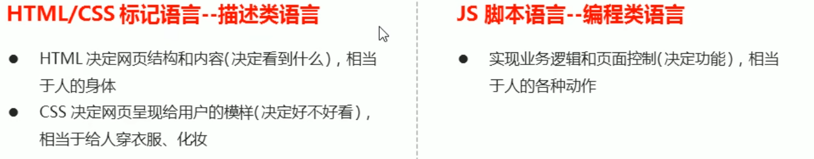
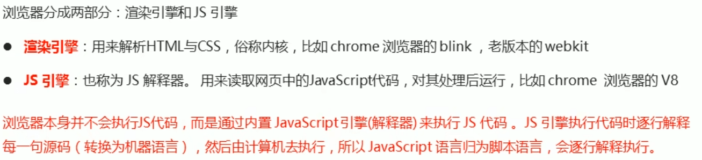
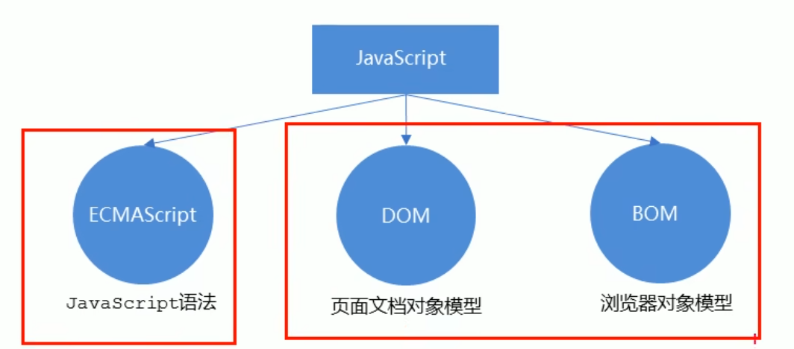
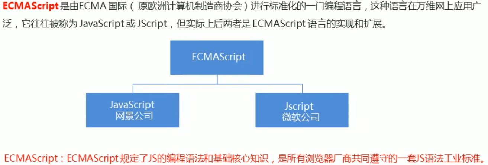
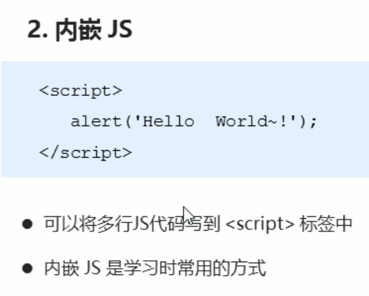
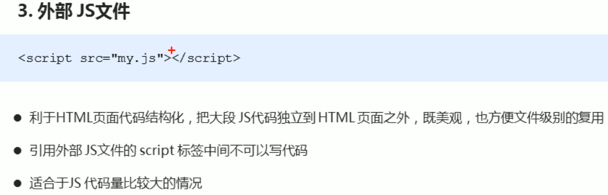
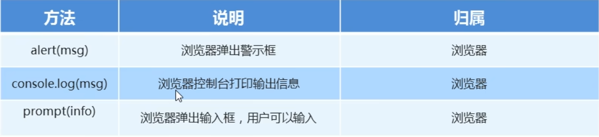
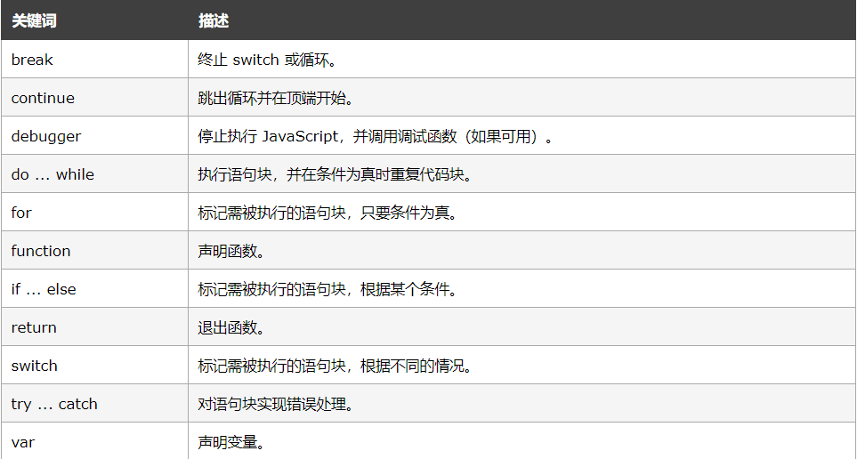

## 初识JavaScript

### JavaScript是什么？

> - JavaScript是世界上最流行的语言之一，是一种运行在客户端的脚本语言(脚本是脚本的意思)
> - 脚本语言: 不需要编译,运行过程中由js解释器(js引擎)逐行来进行解释并执行
> - 现在也可以基于Node.js技术进行服务器端编程

### JavaScript的作用

> ●表单动态校验(密码强度检测) ( JS产性最初的目的)
> ●网页特效.
> ●服务端开发(Node.js)
> ●桌面程序(Electron)
> ●App(Cordova)
> ●控制硬件-物联网(Ruff)
> ●游戏开发(cocos2d-js)

### HTML/CSS/JavaScript的关系

> 

### 浏览器执行JS的过程

> 

### JS的组成

> **JS由三部分组成**
>
> 
>
> 
>
> **DOM和BOM将在API中学习，在此先不做深入讨论**
>
> 
>
> 

## JS初体验

> ## **JavaScript 能够改变 HTML 内容**
>
> `getElementById()` 是多个 JavaScript HTML 方法之一。
>
> 本例使用该方法来“查找” id="demo" 的 HTML 元素，并把元素内容（`innerHTML`）更改为 "Hello JavaScript"：
>
> **注意：JavaScript 同时接受双引号和单引号**

> ```html
> <!DOCTYPE html>
> <html>
> <body>
> 
> <h1>JavaScript 能做什么？</h1>
> 
> <p id="demo">JavaScript 可以更改 HTML 内容。</p>
> 
> <button type="button" onclick="document.getElementById('demo').innerHTML = 'Hello JavaScript!'">单击这里</button>
> 
> </body>
> </html>
> 
> ```

## JS的三种引入方式

> 
>
> 
>
> 

> ```html
> <!DOCTYPE html>
> <html lang="en">
> <head>
>     <meta charset="UTF-8">
>     <meta http-equiv="X-UA-Compatible" content="IE=edge">
>     <meta name="viewport" content="width=device-width, initial-scale=1.0">
>     <title>js的三种引入方式</title>
>     <style>
> 
>     </style>
>     <!-- 2.内嵌式js，zhi'jie -->
>     <script>
>         // alert('')弹出一个提示框
>         
>         // alert('沙漠骆驼')
>     </script>
>     <script src="./01-js的三种引入方式.js">
>         // 3.外部js
>     </script>
> </head>
> <body>
>     <!-- 1.行内式js，直接写入元素的内部 -->
>     <!-- <input type="button" value="唐伯虎" onclick="alert('秋香姐')"> -->
> </body>
> </html>
> ```
>
> ```js
> 文件：01-js的三种引入方式.js
> 内容：
> alert('如果我是DJ，你还爱我吗？')
> ```
>
> 

## JS注释

> ```js
> //1.单上注释
> /*
> 多行注释
> */
> ```
>
> 

## JS输入输出语句 1

> 

> 代码实现
>
> ```html
> <!DOCTYPE html>
> <html lang="en">
> <head>
>     <meta charset="UTF-8">
>     <meta http-equiv="X-UA-Compatible" content="IE=edge">
>     <meta name="viewport" content="width=device-width, initial-scale=1.0">
>     <title>js输入输出语句</title>
>     <script>
>         //这是一个输入框
>         prompt('请输入年龄')
>         //alert 弹出警告框，输出内容展示给用户
>         alert('计算的结果为')
>         //console.log 浏览器控制台打印输出信息
>         console.log('控制台')
>     </script>
> </head>
> <body>
>     
> </body>
> </html>
> ```

## JS输入输出语句 2

> - **JavaScript 不提供任何内建的打印或显示函数。**
>
> - ## JavaScript 显示方案
>
>   JavaScript 能够以不同方式“显示”数据：
>
>   - 使用 `window.alert()` 写入警告框
>   - 使用 `document.write()` 写入 HTML 输出
>   - 使用 `innerHTML` 写入 HTML 元素
>   - 使用 `console.log()` 写入浏览器控制台

>  **使用 innerHTML**
>
>  如需访问 HTML 元素，JavaScript 可使用 `document.getElementById(id)` 方法。
>
>  `id` 属性定义 HTML 元素。innerHTML 属性定义 HTML 内容：
>
>  实例
>
>  ```html
>  <!DOCTYPE html>
>  <html lang="en">
>  <head>
>      <meta charset="UTF-8">
>      <meta http-equiv="X-UA-Compatible" content="IE=edge">
>      <meta name="viewport" content="width=device-width, initial-scale=1.0">
>      <title>js输入输出语句</title>
>  </head>
>  <body>
>      <h2>我的第一张网页</h2>
>      <p>我的第一个段落。</p>
>      <p id="demo"></p>
>  
>      <script>
>          document.getElementById("demo").innerHTML = 5 + 6;
>      </script>
>  </body>
>  </html>
>  ```

>   **使用 document.write()**
>
>  出于测试目的，使用 `document.write()` 比较方便：
>
>  实例
>
>  ```html
>  <!DOCTYPE html>
>  <html lang="en">
>  <head>
>      <meta charset="UTF-8">
>      <meta http-equiv="X-UA-Compatible" content="IE=edge">
>      <meta name="viewport" content="width=device-width, initial-scale=1.0">
>      <title>js输入输出语句</title>
>  </head>
>  <body>
>      <h2>我的第一张网页</h2>
>      <p>我的第一个段落。</p>
>      <p id="demo"></p>
>  
>      <script>
>    	 document.write(5 + 6);
>      </script>
>  </body>
>  </html>
>  ```

> **注意！！！**
>
> 在 HTML 文档完全加载后使用 document.write() 将删除所有已有的 HTML
>
> ```html
> <!DOCTYPE html>
> <html lang="en">
> <head>
> <meta charset="UTF-8">
> <meta http-equiv="X-UA-Compatible" content="IE=edge">
> <meta name="viewport" content="width=device-width, initial-scale=1.0">
> <title>js输入输出语句</title>
> </head>
> <body>
> 	<h1>我的第一张网页</h1>
> 	<p>我的第一个段落</p>
> 	<script>
> 		function myfunction(){
> 		document.write(5 + 6)
> 		}
> 	</script>
> 	<button onclick="myfunction()">点击</button>
> </body>
> </html>
> 意思是，在初次加载网页后若没有运行document.write(),例如现在运行以上代码，鼠标没有点击Button，所以document.write()没有执行，当再次加载网页即按下Button时，document.write()被执行，此时将覆盖整个网页，删除掉初次加载的HTML内容。
> ```

> **使用 window.alert()**
>
> 您能够使用警告框来显示数据：
>
> 实例
>
> ```html
> <!DOCTYPE html>
> <html lang="en">
> <head>
> <meta charset="UTF-8">
> <meta http-equiv="X-UA-Compatible" content="IE=edge">
> <meta name="viewport" content="width=device-width, initial-scale=1.0">
> <title>js输入输出语句</title>
> </head>
> <body>
> 	<h1>我的第一张网页</h1>
> 	<p>我的第一个段落</p>
> 	<script>
> 		window.alert(5 + 6);
> 	</script>
> </body>
> </html>
> ```

> **使用 console.log()**
>
> 在浏览器中，您可使用 `console.log()` 方法来显示数据。
>
> 请通过 F12 来激活浏览器控制台，并在菜单中选择“控制台”。
>
> 实例
>
> ```html
> <!DOCTYPE html>
> <html lang="en">
> <head>
> <meta charset="UTF-8">
> <meta http-equiv="X-UA-Compatible" content="IE=edge">
> <meta name="viewport" content="width=device-width, initial-scale=1.0">
> <title>js输入输出语句</title>
> </head>
> <body>
> 	<h1>我的第一张网页</h1>
> 	<p>我的第一个段落</p>
> 	<script>
> 		window.alert(5 + 6);
> 	</script>
> </body>
> </html>
> ```
>
> 

## JS语句

> **在html中，JavaScript 语句是由 web 浏览器“执行”的“指令”。**
>
> - 在前边已经提到过，js作为脚本语言，由编译器逐行编译
>
> - JavaScript 语句由以下构成：
>
>   值、运算符、表达式、关键词和注释。
>
> - 分号分隔 JavaScript 语句。请在每条可执行的语句之后添加分号
>
> - 如果有分号分隔，允许在同一行写多条语句
>
> - 可能在网上会看到不带分号的例子。
>
>   **提示：**以分号结束语句不是必需的，但我们仍然强烈建议您这么做。
>
>
> 例如：
>
> ```html
> <!DOCTYPE html>
> <html lang="en">
> <head>
>     <meta charset="UTF-8">
>     <meta http-equiv="X-UA-Compatible" content="IE=edge">
>     <meta name="viewport" content="width=device-width, initial-scale=1.0">
>     <title>js语句</title>
> </head>
> <body>
>     <h2>JavaScript 语句</h2>
>     <p><b>JavaScript 程序</b> 是一系列由计算机执行的 <b>语句</b>。</p>
>     <p id="demo"></p>
> 
>     <script>
> 
>     var x, y, z;  // 语句 1
>     x = 22;        // 语句 2
>     y = 11;        // 语句 3
>     z = x + y;    // 语句 4
> 
>     document.getElementById("demo").innerHTML =
>     "z 的值是" + z + "。";  
> 
>     </script>    
> </body>
> </html>
> ```
>
> **JavaScript 行长度和折行**
>
> 为了达到最佳的可读性，程序员们常常喜欢把代码行控制在 80 个字符以内。
>
> 如果 JavaScript 语句太长，对其进行折行的最佳位置是某个运算符
>
> 像这样：
>
> ```js
> document.getElementById("demo").innerHTML =
>  "Hello Kitty.";
> ```
>
> **javaScript 代码块**
>
> JavaScript 语句可以用花括号（`{`...`}`）组合在代码块中。
>
> 代码块的作用是定义一同执行的语句。
>
> 您会在 JavaScript 中看到成块组合在一起的语句
>
> 像这样：
>
> ```js
> function myFunction() {
>     document.getElementById("demo").innerHTML = "Hello Kitty.";
>     document.getElementById("myDIV").innerHTML = "How are you?";
> }
> ```
>
> **JavaScript 关键词**
>
> JavaScript 语句常常通过某个关键词来标识需要执行的 JavaScript 动作。
>
> 下面的表格列出了一部分将在教程中学到的关键词
>
> 
>
> **注释：**JavaScript 关键词指的是保留的单词。保留词无法用作变量名。

## JS语法

> **JavaScript \*语法\*是一套规则，它定义了 JavaScript 的语言结构。**
>
> ```js
> var x, y;	// 如何声明变量
> x = 7; y = 8;	// 如何赋值
> z = x + y;	// 如何计算值
> ```
>
> **JavaScript 值**
>
> - JavaScript 语句定义两种类型的值：混合值和变量值。
>
> - 混合值被称为*字面量（literal）*。变量值被称为*变量*。
>
> **JavaScript 字面量**
>
> - 书写混合值最重要的规则是
> - 写*数值*有无小数点均可
> - *字符串*是文本，由双引号或单引号包围
>
> ## JavaScript 变量
>
> 在编程语言中，*变量*用于*存储*数据值。
>
> JavaScript 使用 `var` 关键词来*声明*变量。
>
> `=` 号用于为变量*赋值*。
>
> 在本例中，x 被定义为变量。然后，x 被赋的值是 7
>
> ```js
> var x;
> x = 7;
> ```
>
> **JavaScript 运算符**
>
> - JavaScript 使用*算数运算符*（`+` `-` `*` `/`）来*计算值*：
>
> ```js
> (7 + 8) * 10
> ```
>
> - JavaScript 使用*赋值运算符*（`=`）向变量*赋值*
>
> ```js
> var x, y;
> var x = 7;
> var y = 8;
> ```
>
> **JavaScript 表达式**
>
> **表达式**是**值、变量和运算符**的组合，计算结果是值。
>
> ```js
> 6 * 10
> ```
>
> 表达式也可包含变量值：
>
> ```js
> x * 10
> ```
>
> 值可以是多种类型，比如数值和字符串。
>
> 例如，"Bill" + " " + "Gates"，计算为 "Bill Gates"
>
> ```js
> "Bill" + " " + "Gates"
> ```
>
> **JavaScript 关键词**
>
> JavaScript *关键词*用于标识被执行的动作。
>
> `var` 关键词告知浏览器创建新的变量：
>
> ```js
> var x = 7 + 8;
> var y = x * 10; 
> ```
>
> **JavaScript 标识符**
>
> 标识符是名称。
>
> 在 JavaScript 中，标识符用于命名变量（以及关键词、函数和标签）。
>
> 在大多数编程语言中，合法名称的规则大多相同。
>
> 在 JavaScript 中，首字符必须是字母、下划线（-）或美元符号（$）。
>
> 连串的字符可以是字母、数字、下划线或美元符号。
>
> **提示：**数值不可以作为首字符。这样，JavaScript 就能轻松区分标识符和数值。
>
> **JavaScript 对大小写敏感**
>
> 所有 JavaScript 标识符*对大小写敏感*。
>
> 变量 `lastName` 和 `lastname`，是两个不同的变量。
>
> ```js
> lastName = "Gates";
> lastname = "Jobs"; 
> ```
>
> JavaScript 不会把 *VAR* 或 *Var* 译作关键词 *var*。
>
> **JavaScript 与驼峰式大小写**
>
> 历史上，程序员曾使用三种把多个单词连接为一个变量名的方法：
>
> **连字符：**
>
> ```js
> first-name, last-name, master-card, inter-city.
> ```
>
> **注释：**JavaScript 中不能使用连字符。它是为减法预留的。
>
> **下划线：**
>
> ```js
> first_name, last_name, master_card, inter_city.
> ```
>
> **驼峰式大小写（Camel Case）：**
>
> ```js
> FirstName, LastName, MasterCard, InterCity.
> ```
>
> JavaScript 程序员倾向于使用以小写字母开头的驼峰大小写：
>
> ```js
> firstName, lastName, masterCard, interCity
> ```
>
> **JavaScript 字符集**
>
> JavaScript 使用 *Unicode* 字符集。
>
> Unicode 覆盖世界上几乎所有的字符、标点和符号。

## JS变量

>  **JavaScript 变量**
>
>  JavaScript 变量是存储数据值的容器。
>
>  在本例中，x、y 和 z 是变量：
>
>  ### 实例
>
>  ```js
>  var x = 7;
>  var y = 8;
>  var z = x + y; 
>  ```
>
>  从上例中，可获得：
>
>  - x 存储值 7
>  - y 存储值 8
>  - z 存储值 15
>
>  **类似代数**
>
>  在本例中，price1、price2 以及 total 是变量：
>
>  **实例**
>
>  ```js
>  var price1 = 7;
>  var price2 = 8;
>  var price3 = 12;
>  var total = price1 + price2 + price3;
>  ```
>
>  在编程中，类似代数，我们使用变量（比如 price1）来存放值。
>
>  在编程中，类似代数，我们在表达式中使用变量（total = price1 + price2+ price3）。
>
>  从上例中，您可以算出 total 的值是 27。
>
>  **提示：**JavaScript 变量是存储数据值的容器。
>
>  **JavaScript 标识符**
>
>  所有 JavaScript ***变量***必须以***唯一的名称***的***标识***。
>
>  这些唯一的名称称为***标识符***。
>
>  标识符可以是短名称（比如 x 和 y），或者更具描述性的名称（age、sum、totalVolume）。
>
>  构造变量名称（唯一标识符）的通用规则是：
>
>  - 名称可包含字母、数字、下划线和美元符号
>  - 名称必须以字母开头
>  - 名称也可以 `$` 和 `_` 开头（但是在本教程中我们不会这么做）
>  - 名称对大小写敏感（y 和 Y 是不同的变量）
>  - 保留字（比如 JavaScript 的关键词）无法用作变量名称
>
>  **提示：**JavaScript 标识符对大小写敏感。
>
>  **赋值运算符**
>
>  在 JavaScript 中，同其他高级语言一样等号（`=`）是赋值运算符，而不是“等于”运算符。
>
>  这一点与代数不同。下面的代码在代数中是不合理的：
>
>  ```js
>  x = x + 5
>  ```
>
>  然而在 JavaScript 中，它非常合理：把 x + 5 的值赋给 x。
>
>  （计算 x + 5 的值并把结果放入 x 中。x 的值递增 5。）
>
>  **注释：**JavaScript 中的“等于”运算符是 `==`。
>
>  **JavaScript 数据类型**
>
>  JavaScript 变量可存放数值，比如 100，以及文本值，比如 "Bill Gates"。
>
>  在编程中，文本值被称为字符串。
>
>  JavaScript 可处理多种数据类型，但是现在，我们只关注数值和字符串值。
>
>  字符串被包围在双引号或单引号中。数值不用引号。
>
>  如果把数值放在引号中，会被视作文本字符串。
>
>  **实例**
>
>  ```js
>  var pi = 3.1415926;
>  var person = "Bill Gates";
>  var answer = 'How are you!';
>  ```
>
>  **声明（创建） JavaScript 变量**
>
>  在 JavaScript 中创建变量被称为“声明”变量。
>
>  您可以通过 `var` 关键词来声明 JavaScript 变量：
>
>  ```
>  var carName;
>  ```
>
>  声明之后，变量是没有值的。（技术上，它的值是 `undefined`意为不可发现，它与NULL并不相同，NULL是指空值。）
>
>  如需*赋值*给变量，请使用等号：
>
>  ```js
>  carName = "porsche";
>  ```
>
>  您可以在声明变量时向它赋值：
>
>  ```js
>  var carName = "porsche";
>  ```
>
>  在上面的例子中，我们创建了名为 carName 的变量，并向其赋值 "porsche"。
>
>  然后，我们在 id="demo" 的 HTML 段落中“输出”该值：
>
>  **实例**
>
>  ```js
>  <p id="demo"></p>
>  
>  <script>
>  var carName = "porsche";
>  document.getElementById("demo").innerHTML = carName; 
>  </script>
>  ```
>
>  **注意：**在脚本的开头声明所有变量是个好习惯！
>
>  **一条语句，多个变量**
>
>  您可以在一条语句中声明许多变量。
>
>  以 `var` 作为语句的开头，并以*逗号*分隔变量：
>
>  ```js
>  var person = "Bill Gates", carName = "porsche", price = 15000;
>  ```
>
>  声明可横跨多行：
>
>  ```js
>  var person = "Bill Gates",
>  carName = "porsche",
>  price = 15000;
>  ```
>
>  **重复声明 JavaScript 变量**
>
>  如果再次声明某个 JavaScript 变量，将不会丢它的值。
>
>  在这两条语句执行后，变量 carName 的值仍然是 "porsche"，当然，我们很少会这样做
>
>  **实例**
>
>  ```js
>  var carName = "porsche";
>  var carName; 
>  ```
>
>  **字符串可以使用加号，但是字符串将被级联：**
>
>  **实例**
>
>  ```js
>  var x = "Bill" + " " + "Gates";
>  ```
>
>  试试这个：
>
>  ```js
>  var x = "8" + 3 + 5;
>  ```
>
>  **注意**：如果把要给数值放入引号中，其余数值会被视作字符串并被级联。

## JS Let


