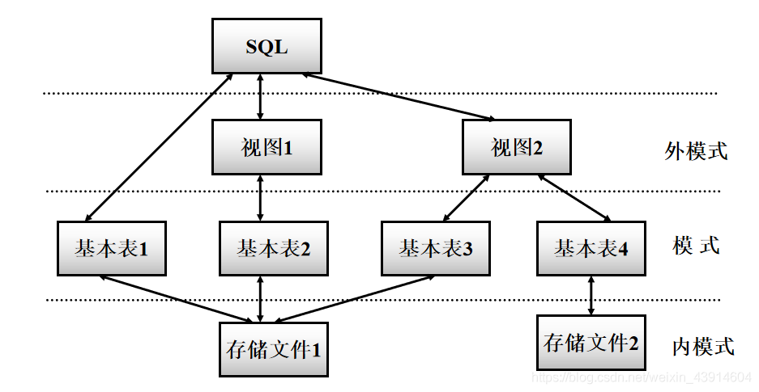

# 第三章 SQL

## 3.1. SQL概述

### 3.1.1.SQL的产生和发展

**（1）什么是SQL?**

> SQL（Structured Query Language）结构化查询语言，是关系数据库的标准语言 SQL是一个通用的、功能极强的关系数据库语言

> 由于SQL的标准日益增多，所以目前没有一个数据库系统能够支持SQL标准的所有概念和特性。许多软件厂商对SQL基本命令集还进行了不同程度的扩充和修改，又可以支持标准以外的一些功能特性。

### 3.1.2SQL的特点

#### ① 综合统一

> 集  模式数据定义语言 DDL，外模式数据定义语言 外模式DDL，数据存储有关的描述语言 DSDL，数据操纵语言 DML 功能于一体 可以独立完成数据库生命周期中的全部活动。

> - 定义关系模式，插入数据，建立数据库
>
> - 对数据库中的数据进行查询和更新
>
> - 数据库重构和维护
>
> - 数据库安全性、完整性控制等
>
> - 嵌入式SQL和动态SQL定义
>
>   
>
>   用户数据库投入运行后，可根据需要随时逐步修改模式，不影响数据的运行。 数据操作符统一
>

####② 高度非过程化

> 非关系数据模型的数据操纵语言“面向过程”，必须制定存取路径 SQL只要提出“做什么”，无须了解存取路径。 存取路径的选择以及SQL的操作过程由系统自动完成。

#### ③ 面向集合的操作方式

> 非关系数据模型采用面向记录的操作方式，操作对象是一条记录 SQL采用集合操作方式： 操作对象、查找结果可以是元组的集合 一次插入、删除、更新操作的对象可以是元组的集合

####④ 以同一种语法结构提供多种使用方式

> SQL是独立的语言 能够独立地用于联机交互的使用方式 SQL又是嵌入式语言 SQL能够嵌入到高级语言（例如C，C++，Java）程序中，供程序员设计程序时使用

####⑤ 语言简洁，易学易用

> SQL功能极强，完成核心功能只用了9个动词。

| SQL功能  | 动词                   |
| -------- | ---------------------- |
| 数据查询 | SELECT                 |
| 数据定义 | CREATE、DROP、ALTER    |
| 数据操纵 | INSERT、UPDATE、DELETE |
| 数据控制 | GRANT、REVOKE          |

###3.1.3 SQL的基本概念

> **SQL支持关系数据库三级模式结构**

> **基本表**
>
> 本身独立存在的表 SQL中一个关系就对应一个基本表 一个(或多个)基本表对应一个存储文件 一个表可以带若干索引
>

> **存储文件**
>
> 逻辑结构组成了关系数据库的内模式 物理结构是任意的，对用户透明
>

> **视图**
>
> 从一个或几个基本表导出的表 数据库中只存放视图的定义而不存放视图对应的数据 视图是一个虚表 用户可以在视图上再定义视图
>

##3.2. 学生-课程数据库

​			**看课本**

##3.3. 数据定义

####数据定义概览

> SQL的数据定义功能: **模式**定义、**表**定义、**视图**和**索引**的定义
>
> 

###3.3.1模式的定义与删除—SCHEMA

####① 定义模式                                                                                                                                                                                                                                                                                                                                                                                                                                                                                                                                                                                                                                                                                                                                                                                                                                                                                                    

> 定义模式实际上定义了一个命名空间
>
> 在这个空间中可以定义该模式包含的数据库对象，例如基本表、视图、索引等。
>

> 在**CREATE SCHEMA（定义模式）**中可以接受**CREATE TABLE（定义表）**，**CREATE VIEW（定义视图）**和**GRANT（授权）**
>
> 即：**CREATE SCHEMA &lt;模式名&gt; AUTHORIZATION &lt;用户名&gt;[&lt;表定义子句&gt;|&lt;视图定义子句&gt;|&lt;授权定义子句&gt;]**
>
> creat schema:创建模式
>
> authorization：授权，批准

> **SQL中，模式定义语句：如果没有指定&lt;模式名&gt;，那么&lt;模式名&gt;隐含为&lt;用户名&gt;**

####② 删除模式

> **语句**：**DROP SCHEMA &lt;模式名&gt; &lt;CASCADE|RESTRICT&gt;**
>
> **必选CASCADE(级联)和RESTRICT(限制)两种之一**
>
> **CASCADE(级联)** 删除模式的同时把该模式中所有的数据库对象全部删除
>
> **RESTRICT(限制)** 如果该模式中定义了下属的数据库对象（如表、视图等），则拒绝该删除语句的执行。**当该模式中没有任何下属的对象时才能执行。**

###3.3.2基本表的定义、删除与修改—TABLE

### ① 定义基本表的标准格式

>   CREATE TABLE &lt;表名&gt;(       &lt;列名&gt; &lt;数据类型&gt;[ &lt;列级完整性约束条件&gt; ]       [，&lt;列名&gt; &lt;数据类型&gt;[ &lt;列级完整性约束条件&gt;] ]        ………       [，&lt;表级完整性约束条件&gt; ] )； 

**如果完整性约束条件涉及到该表的多个属性列，则必须定义在表级上，否则既可以定义在列级也可以定义在表级。**

**看教材上附属例题理解**

### ② 数据类型

SQL中域的概念用数据类型来实现

定义表的属性时 需要指明其数据类型及长度

**选用哪种数据类型、取值范围、要做哪些运算** 不同数据库的数据类型可能有所不同，可查相关文档。

### ③ 修改基本表

>   ALTER TABLE &lt;表名&gt; [ ADD &lt;新列名&gt; &lt;数据类型&gt; [ 完整性约束 ] ] [ DROP &lt;完整性约束名&gt; ] [ ALTER COLUMN&lt;列名&gt; &lt;数据类型&gt; ]； 

>   在ADD下方可以插入 
>   DROP COLUMN子句用于删除表中的列，指定的话可以删除引用该列的其他对象，比如视图 
>   DROP CONSTRAINT子句用于删除指定的完整性约束条件 

### ④ 删除基本表

标准格式：

DROP TABLE &lt;表名&gt;［RESTRICT| CASCADE］；

>   RESTRICT：删除表是有限制的。 
>   欲删除的基本表不能被其他表的约束所引用 如果存在依赖该表的对象，则此表不能被删除 

>   CASCADE：删除该表没有限制。 在删除基本表的同时，相关的依赖对象一起删除 

## （4）索引的建立与删除—INDEX

### 建立索引的目的：加快查询速度

DBA 或 表的属主（即建立表的人） DBMS一般会自动建立以下列上的索引 PRIMARY KEY UNIQUE

DBMS自动完成

使用索引

DBMS自动选择是否使用索引以及使用哪些索引**RDBMS中索引一般采用B+树、HASH索引来实现**

>   B+树索引具有动态平衡的优点 HASH索引具有查找速度快的特点 采用B+树，还是HASH索引 则由具体的RDBMS来决定 

索引是关系数据库的内部实现技术，属于内模式的范畴

CREATE INDEX语句定义索引时，可以定义索引是唯一索引、非唯一索引或聚簇索引

### ① 建立索引的标准格式

语句格式：

>   CREATE [UNIQUE] [CLUSTER] INDEX &lt;索引名&gt;  ON &lt;表名&gt;(&lt;列名&gt;[&lt;次序&gt;][,<列名>[<次序>] ]…)；     

**[例14]为学生-课程数据库中的Student，Course，SC三个表建立索引。**

Student表按学号升序建唯一索引 Course表按课程号升序建唯一索引 SC表按学号升序和课程号降序建唯一索引

>   CREATE UNIQUE INDEX  Stusno ON Student(Sno); CREATE UNIQUE INDEX  Coucno ON Course(Cno); CREATE UNIQUE INDEX  SCno ON SC(Sno ASC,Cno DESC); 

### ② 删除索引

>   **DROP INDEX &lt;索引名&gt; ON &lt;表名&gt;;** DROP INDEX &lt;表名&gt;.&lt;索引名&gt;; 

删除索引时，系统会从数据字典中删去有关该索引的描述。

[例15] 删除Student表的Stusname索引

   DROP INDEX Stusno ON Student;    //等价    DROP INDEX Student.Stusno;

## （5）数据字典

数据字典是关系数据库管理系统内部的一组系统表，它记录了数据库中所有的定义信息，包括关系模式定义、视图定义、索引定义、完整性约束定义、各类用户对数据库的操作权限、统计信息等。 关系数据库管理系统在执行SQL的数据定义语句时，实际上就是在更新数据字典表中的相应信息。 在进行查询优化和查询处理时，数据字典中的信息是其重要依据。

# 后续小章节

后续章节更多的需要与书中例题结合，建议在章节内结合例题与概念理解更透彻，后面可写内容不多，我将会整理一下某些数据的一般创建格式。

# 4. 数据查询

数据查询是数据的操作核心，SQL提供了SELECT语句进行查询

一般格式：

>   SELECT [ALL | DISTINCT ]&lt;目标列表达式&gt;[,&lt;目标列表达式&gt;]... 
>   FROM&lt;表名或视图名&gt;[,&lt;表名或视图名&gt;...] | (&lt;SELECT语句&gt;)[AS]&lt;别名&gt; 
>   [WHERE&lt;条件表达式&gt;] 
>   [GROUP BY&lt;列名1&gt;[HAVING&lt;条件表达式&gt;]] 
>   [ORDER BY&lt;列名2&gt;[ASC | DESC]] 

有GROUP BY子句，按照&lt;列名1&gt;的值分组

有ORDER BY子句，按照&lt;列名2&gt;的值升序降序排序

### 集合查询

SELECT语句的查询结果是元祖的集合，所以多个SELECT语句的结果可进行集合操作

**主要包括并操作UNION、交操作INTERSECT和差操作EXCEPT**

# 5. 数据更新

插入元组：（INSERT）格式：

INSERT

INTO&lt;表名&gt;[(&lt;属性列1&gt;[,&lt;属性列2&gt;]...)]

VALUES(&lt;常量1&gt;[,&lt;常量2&gt;]...);

# 6. 空值的处理

空值：“不存在”“不知道”“无意义”的值，特殊的值，有不确定性

>   情况： 
>   该属性应该有一个值，但目前不清楚它的具体值。 
>   该属性不应该有值 
>   由于某种原因不便于填写 

#  7. 视图

## SQL语言用CREATE VIEW 建立视图，格式：

>   CREATE VIEW&lt;视图名&gt;[(&lt;列名&gt;[,&lt;列名&gt;]...)] 
>   AS&lt;子查询&gt; 
>   [WITH CHECK OPTION]; 

## 视图作用 

>   简化用户的操作 
>   使用户能以多种角度看待同一数据 
>   对重构数据库提供了一定程度的逻辑独立性 
>   对机密数据提供安全保护 
>   可以更清晰地表达查询 